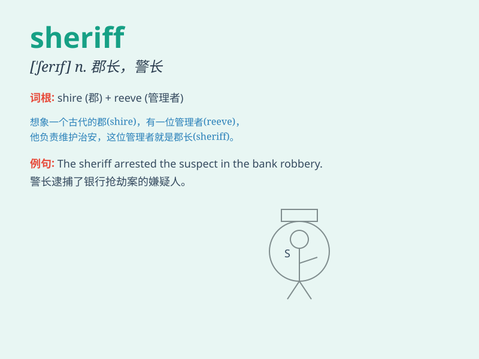

## sheriff

**英音:** _[\'ʃerɪf]_ **美音:** _[\'ʃɛrɪf]_

**译义:** *n.郡治安官,州长*

### 短语

+ **county sheriff:** _县治安官_

+ **sheriff\'s department:** _治安官部门_

+ **sheriff\'s deputy:** _治安官副手_

+ **elected sheriff:** _当选的治安官_

+ **sheriff\'s office:** _治安官办公室_

### 例句

#### 例句1

> **The sheriff led the search for the missing child.**

**中文翻译:** 这位警长领导了对失踪儿童的搜寻。

**单词释义:** 警长

#### 例句2

> **The sheriff was responsible for maintaining law and order in the
county.**

**中文翻译:** 这位治安官负责维护该县的法律和秩序。

**单词释义:** 治安官

#### 例句3

> **The citizens elected a new sheriff in the recent election.**

**中文翻译:** 在最近的选举中，市民们选出了一位新的警长。

**单词释义:** 警长

### 背诵小故事

> In a small town, there was a crime. Everyone was in panic. But the
sheriff was brave. He found the clues and caught the bad guys. The town
was safe again because of the smart and courageous sheriff.

**在一个小镇上，发生了一起犯罪案件。大家都很恐慌。但治安官很勇敢。他找到了线索并抓住了坏人。因为这位聪明勇敢的治安官，小镇再次安全了。**

### 图义

