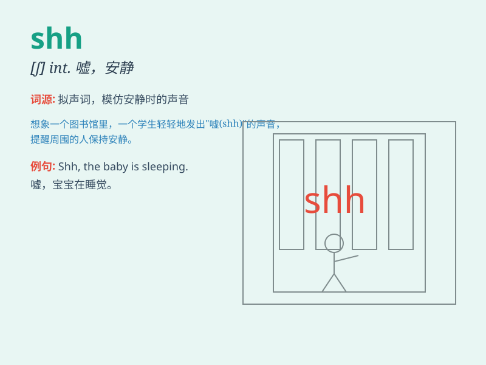

## shh

**英音:** _[ʃ]_ **美音:** _[ʃ]_

**译义:** *int.嘘,安静一点 shew [古]show*

### 短语

+ **shh quiet:** _嘘，安静_

+ **shh baby:** _嘘，宝贝_

+ **shh don\'t talk:** _嘘，别说话_

+ **shh listen:** _嘘，听_

+ **shh be silent:** _嘘，保持沉默_

### 例句

#### 例句1

> **Shh! The baby is sleeping.**

**中文翻译:** 嘘！宝宝在睡觉。

**单词释义:** 表示安静，别出声

#### 例句2

> **Shh! We need to be quiet in the library.**

**中文翻译:** 嘘！在图书馆我们需要保持安静。

**单词释义:** 示意保持安静

#### 例句3

> **Shh! Don\'t wake up the neighbors.**

**中文翻译:** 嘘！别吵醒邻居。

**单词释义:** 让人安静，以免造成不良影响

### 背诵小故事

> In a quiet library, a little girl was reading her favorite book.
Suddenly, someone made a noise. The librarian quickly said \'Shh\' to
keep the place silent. So, when you want someone to be quiet, just say
\'Shh\'.

**在一个安静的图书馆里，一个小女孩正在读她最喜欢的书。突然，有人弄出了声响。图书管理员赶紧说'嘘'来保持安静。所以，当你想让某人安静时，就说'嘘'。**

### 图义

