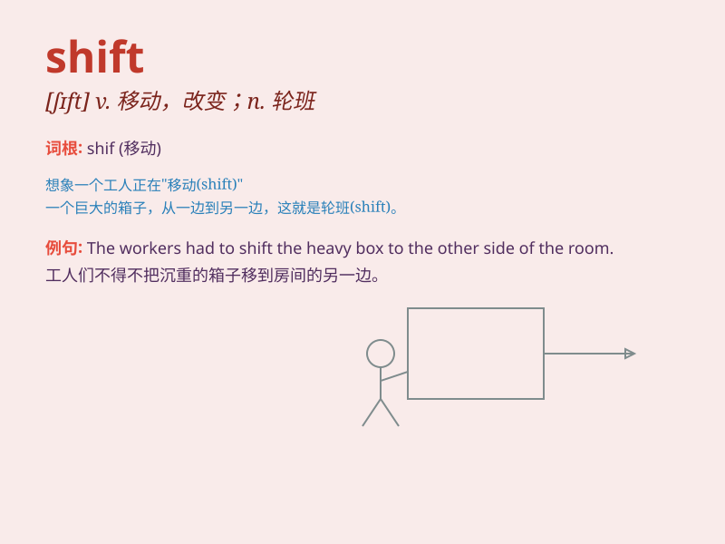

## shift

**英音:** _[ʃɪft]_ **美音:** _[ʃɪft]_

**译义:**
*n.移动,轮班,移位,变化,办法,手段vt.替换,转移,改变,移转,推卸,变速vi.转换,移动,转变,推托,变速*

### 短语

+ **shift gears:** _换挡；改变方式；改变策略_

+ **night shift:** _夜班；夜班工作_

+ **shift work:** _轮班工作；倒班工作_

+ **shift focus:** _转移焦点；改变重点_

+ **shift responsibility:** _推卸责任_

### 例句

#### 例句1

> **The night shift workers start their job at 10 p.m.**

**中文翻译:** 夜班工人晚上 10 点开始工作。

**单词释义:** 轮班；当班时间

#### 例句2

> **She shifted her position on the chair.**

**中文翻译:** 她在椅子上变换了一下姿势。

**单词释义:** 改变；移动

#### 例句3

> **The wind shifted to the south.**

**中文翻译:** 风向转南了。

**单词释义:** （风）改变方向

### 背诵小故事

> A factory worker was always tired because of the frequent shift
changes. One day, he decided to learn how to manage these shifts better.
With effort, he mastered it and his life became easier. \'Shift\' means
a change or move.

**一位工厂工人因频繁的轮班变动总是很疲惫。有一天，他决定学习如何更好地应对这些轮班。通过努力，他掌握了，生活也变得轻松了。'shift'意思是改变、移动。**

### 图义

