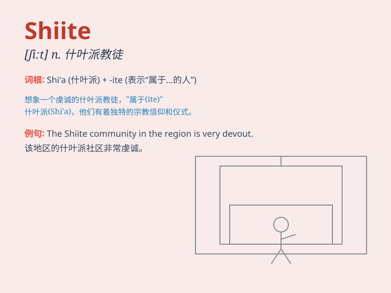

## Shiite

**英音:** _[ˈʃiːaɪt]_ **美音:** _[ˈʃiːaɪt]_

**译义:** *n.什叶派（教徒）*

### 短语

+ **Shiite Islam:** _什叶派伊斯兰教_

+ **Shiite community:** _什叶派社区_

+ **Shiite mosque:** _什叶派清真寺_

+ **Shiite cleric:** _什叶派神职人员_

+ **Shiite majority:** _什叶派多数派_

### 例句

#### 例句1

> **The Shiite community has its own religious practices and
beliefs.**

**中文翻译:** 什叶派社区有其自身的宗教习俗和信仰。

**单词释义:** 什叶派（的）

#### 例句2

> **Shiite leaders often play a significant role in local
politics.**

**中文翻译:** 什叶派领袖常常在当地政治中发挥重要作用。

**单词释义:** 什叶派（的）

#### 例句3

> **The conflict between Sunni and Shiite groups has a long
history.**

**中文翻译:** 逊尼派和什叶派团体之间的冲突由来已久。

**单词释义:** 什叶派（的）

### 背诵小故事

> One day, Tom met a person who identified as Shiite. The person
explained that Shiite is a branch of Islam. Tom was curious and started
to learn more about it.

**有一天，汤姆遇到了一个自称为什叶派的人。这个人解释说什叶派是伊斯兰教的一个分支。汤姆很好奇，开始去更多地了解它。**

### 图义

