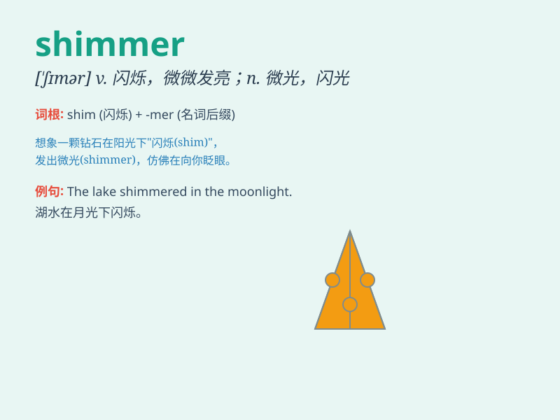

## shimmer

**英音:** _[\'ʃɪmə]_ **美音:** _[\'ʃɪmɚ]_

**译义:** *n.微光*

### 短语

+ **shimmer with:** _闪烁着；闪耀着_

+ **shimmer light:** _微光；闪烁的光_

+ **shimmer effect:** _闪烁效果；微光效果_

+ **shimmer softly:** _柔和地闪烁_

+ **shimmering surface:** _闪烁的表面_

### 例句

#### 例句1

> **The stars shimmered in the clear night sky.**

**中文翻译:** 星星在晴朗的夜空中闪烁。

**单词释义:** 闪烁

#### 例句2

> **The lake shimmered in the sunlight.**

**中文翻译:** 湖水在阳光下闪闪发光。

**单词释义:** 闪闪发光

#### 例句3

> **Her dress shimmered as she moved on the dance floor.**

**中文翻译:** 她在舞池里移动时，她的裙子闪烁着光芒。

**单词释义:** 闪烁

### 背诵小故事

> In the deep forest, a magical lake shimmered under the moonlight. The
water surface seemed to be covered with countless diamonds, constantly
reflecting and twinkling. This beautiful scene made me remember the word
\'shimmer\' which means to shine with a soft, unsteady light.

**在幽深的森林里，有一片神奇的湖泊在月光下闪烁着光芒。水面仿佛铺满了无数钻石，不停地反射和闪烁。这个美丽的场景让我记住了'shimmer'这个单词，它的意思是发出柔和、不稳定的光。**

### 图义

