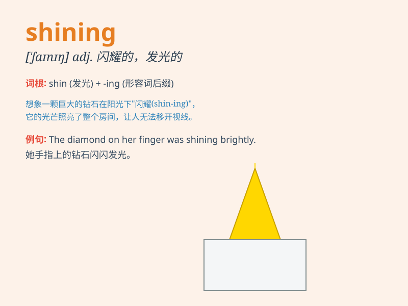

## shining

**英音:** _[\'ʃaɪnɪŋ]_ **美音:** _[\'ʃaɪnɪŋ]_

**译义:** *adj.光亮的,华丽的*

### 短语

+ **shining example:** _光辉的榜样_

+ **shining moment:** _辉煌时刻_

+ **shining star:** _闪亮的星星_

+ **shining armour:** _闪亮的盔甲_

+ **shining light:** _耀眼的光_

### 例句

#### 例句1

> **The sun was shining brightly in the sky.**

**中文翻译:** 太阳在天空中明亮地照耀着。

**单词释义:** 照耀；发光

#### 例句2

> **Her eyes were shining with excitement.**

**中文翻译:** 她的眼睛因兴奋而闪闪发光。

**单词释义:** 闪烁；发亮

#### 例句3

> **The shining stars filled the night sky.**

**中文翻译:** 闪烁的星星布满了夜空。

**单词释义:** 闪耀的；发光的

### 背诵小故事

> One night, I was lost in the forest. Suddenly, I saw a shining light
in the distance. It was like a guiding star, leading me out of the
darkness. The shining light gave me hope and courage.

**一天晚上，我在森林里迷路了。突然，我看到远处有一道闪耀的光。它就像一颗指路星，引领我走出黑暗。这道闪耀的光给了我希望和勇气。**

### 图义

