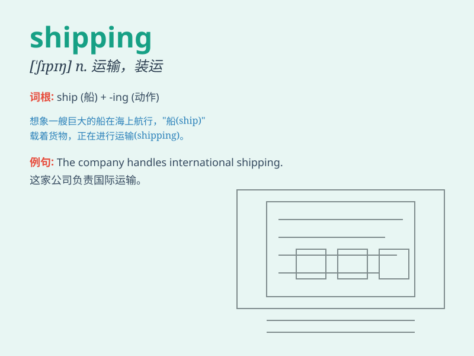

## shipping

**英音:** _[\'ʃɪpɪŋ]_ **美音:** _[\'ʃɪpɪŋ]_

**译义:** *n.海运,运送,航行,(总称)运输船只,船舶吨数,船只总数*

### 短语

+ **shipping cost:** _运输成本；运费_

+ **shipping container:** _海运集装箱；船运集装箱_

+ **shipping company:** _航运公司；船运公司_

+ **shipping industry:** _航运业；海运业_

+ **shipping address:** _送货地址；发货地址_

### 例句

#### 例句1

> **The shipping cost is included in the price.**

**中文翻译:** 运输成本包含在价格里。

**单词释义:** 运输；航运

#### 例句2

> **The company is involved in international shipping.**

**中文翻译:** 这家公司从事国际航运业务。

**单词释义:** 航运

#### 例句3

> **We need to check the shipping details before sending the
package.**

**中文翻译:** 在发送包裹之前，我们需要检查运输细节。

**单词释义:** 运输；发货

### 背诵小故事

> A brave captain led his crew on a long journey. They worked hard on
the ship, loading and unloading goods. The process of sending and
receiving these goods was called shipping. It was their job to make sure
everything arrived safely.

**一位勇敢的船长带领他的船员进行了一次长途旅行。他们在船上努力工作，装卸货物。发送和接收这些货物的过程被称为运输。确保一切安全抵达是他们的工作。**

### 图义

