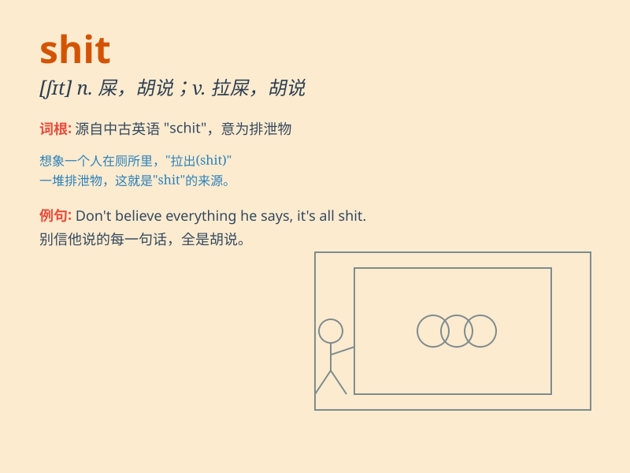

## shit

**英音:** _[ʃɪt]_ **美音:** _[ʃɪt]_

**译义:**
*vi.拉屎,\<俚>对\...胡扯,企图欺骗,取笑vt.欺骗n.粪,屎int.狗屁!*

### 短语

+ **bull shit:** _胡说；废话_

+ **hot shit:** _了不起；非常出色_

+ **give a shit:** _在乎；关心_

+ **no shit:** _真的；可不是嘛_

+ **eat shit:** _忍辱；受气_

### 例句

#### 例句1

> **Oh, shit! I forgot my keys.**

**中文翻译:** 哦，糟糕！我忘了带钥匙。

**单词释义:** 表示愤怒、沮丧或惊讶

#### 例句2

> **You\'re talking shit.**

**中文翻译:** 你在胡说八道。

**单词释义:** 无意义的话；废话

#### 例句3

> **This job is a shit one.**

**中文翻译:** 这份工作糟透了。

**单词释义:** 糟糕的；讨厌的

### 背诵小故事

> One day, Tom was walking in the park and stepped in something smelly.
He looked down and shouted, \'Oh, shit! It\'s dog poop!\' This made him
very unhappy.

**一天，汤姆在公园散步，踩到了一些臭烘烘的东西。他低头一看并喊道："哦，该死！是狗屎！"这让他非常不高兴。**

### 图义

