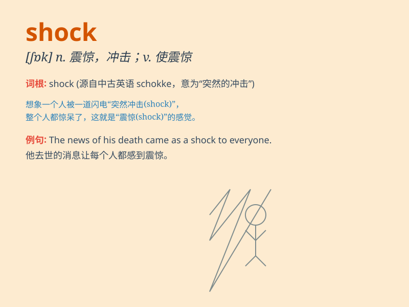

## shock

**英音:** _[ʃɒk]_ **美音:** _[ʃɑk]_

**译义:**
*n.打击,震动,冲突,休克,突击,禾束堆,乱蓬的头发vt.使震动,使休克,使受电击,震惊得vi.震动,吓人adj.蓬乱的,浓密的*

### 短语

+ **electric shock:** _电击_

+ **culture shock:** _文化冲击_

+ **shock absorber:** _减震器；缓冲器_

+ **in shock:** _处于休克状态_

+ **shock treatment:** _休克疗法；冲击治疗_

### 例句

#### 例句1

> **The news of his death came as a shock to us all.**

**中文翻译:** 他去世的消息令我们所有人感到震惊。

**单词释义:** 震惊；令人震惊的事

#### 例句2

> **She got an electric shock when she touched the wire.**

**中文翻译:** 当她触碰电线时，她触电了。

**单词释义:** 电击

#### 例句3

> **The shock of the explosion could be felt miles away.**

**中文翻译:** 爆炸的冲击力在数英里之外都能感受到。

**单词释义:** 震动；冲击

### 背诵小故事

> A brave man was walking in a forest. Suddenly, he saw a huge snake
and was shocked. His heart beat fast and he couldn\'t move. But he took
a deep breath and slowly walked away.

**一个勇敢的人正在森林里走。突然，他看到一条巨大的蛇，被震惊了。他心跳加速，无法动弹。但他深吸一口气，慢慢走开了。**

### 图义

