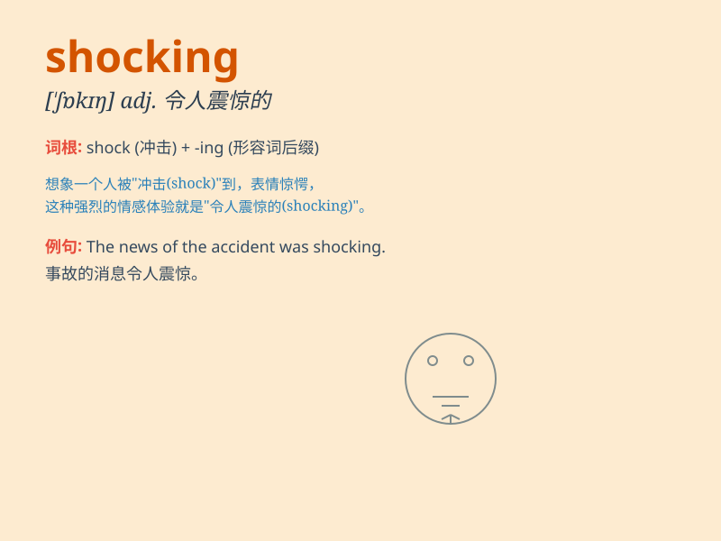

## shocking

**英音:** _[\'ʃɒkɪŋ]_ **美音:** _[\'ʃɑkɪŋ]_

**译义:** *adj.骇人听闻的,非常讨厌的,不正当的*

### 短语

+ **shocking news:** _令人震惊的消息_

+ **shocking behavior:** _令人震惊的行为_

+ **shocking discovery:** _令人震惊的发现_

+ **shocking event:** _令人震惊的事件_

+ **shocking truth:** _令人震惊的真相_

### 例句

#### 例句1

> **The news of the accident was shocking.**

**中文翻译:** 事故的消息令人震惊。

**单词释义:** 令人震惊的

#### 例句2

> **Her behavior was shocking to everyone.**

**中文翻译:** 她的行为让所有人都感到震惊。

**单词释义:** 令人震惊的

#### 例句3

> **The level of corruption was shocking.**

**中文翻译:** 腐败程度令人震惊。

**单词释义:** 令人震惊的

### 背诵小故事

> A man was walking in the park. Suddenly, a tree fell right in front
of him. It was a shocking moment. He never expected such a dangerous
thing to happen.

**一个男人正在公园里散步。突然，一棵树正好在他面前倒下了。这是令人震惊的一刻。他从未料到会发生这样危险的事。**

### 图义

