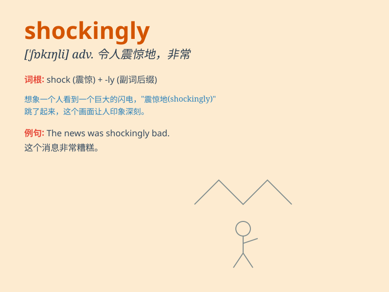

## shockingly

**英音:** _[\'ʃɒkɪŋli]_ **美音:** _[\'ʃɒkɪŋli]_

**译义:** *adv.怕人地,非常地*

### 短语

+ **shockingly bad:** _糟糕得令人震惊_

+ **shockingly cruel:** _极其残忍_

+ **shockingly expensive:** _贵得惊人_

+ **shockingly beautiful:** _美得出奇_

+ **shockingly unfair:** _极其不公平_

### 例句

#### 例句1

> **Shockingly, he failed the exam despite all his efforts.**

**中文翻译:** 令人震惊的是，尽管他付出了一切努力，但考试还是失败了。

**单词释义:** 令人震惊地

#### 例句2

> **The crime rate in this area is shockingly high.**

**中文翻译:** 该地区的犯罪率高得惊人。

**单词释义:** 惊人地

#### 例句3

> **Shockingly, she quit her well-paid job without a second
thought.**

**中文翻译:** 令人震惊的是，她毫不犹豫地辞去了高薪工作。

**单词释义:** 令人吃惊地

### 背诵小故事

> A man was walking in the forest shockingly finding a huge snake. He
was so scared that his heart almost stopped. This unexpected scene made
him understand the meaning of shockingly.

**一个男人正在森林里走着，令人震惊地发现了一条巨大的蛇。他害怕极了，心都快停止跳动了。这个意外的场景让他明白了
shockingly 的意思。**

### 图义

