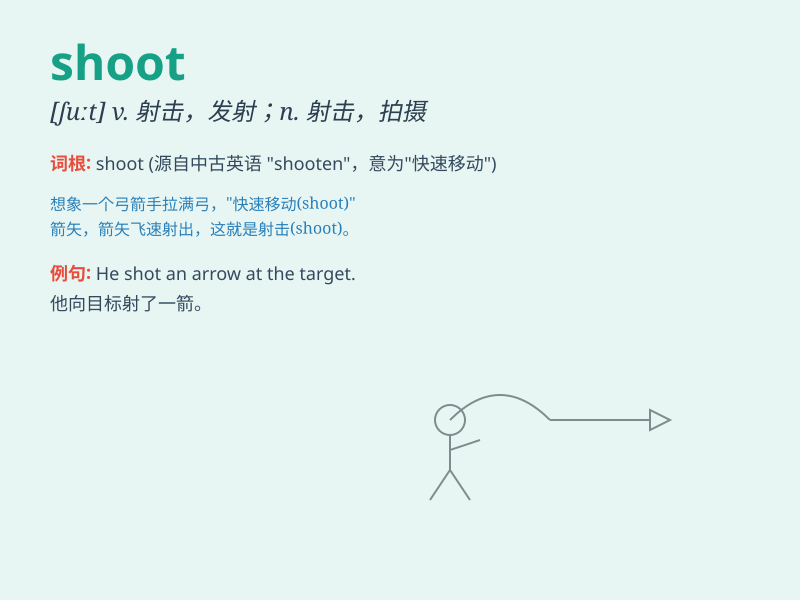

## shoot

**英音:** _[ʃuːt]_ **美音:** _[ʃut]_

**译义:**
*n.射击,发射,摄影,急流vt.射击,投射,伸出,拍摄,用完,挥出,给\...注射,使爆炸vi.射出,射击,发出,发芽,射门,拍电影*

### 短语

+ **shoot up:** _迅速成长；激增_

+ **shoot down:** _击落；驳倒_

+ **shoot for:** _争取；试图达到_

+ **shoot out:** _突然伸出；射出_

+ **shoot through:** _逃走；穿过_

### 例句

#### 例句1

> **He aimed and shot the target accurately.**

**中文翻译:** 他准确地瞄准并射击了目标。

**单词释义:** 射击；开枪

#### 例句2

> **The plant is shooting up rapidly.**

**中文翻译:** 该植物正在迅速生长。

**单词释义:** 迅速生长；发芽

#### 例句3

> **The movie was shooting in a small town.**

**中文翻译:** 这部电影是在一个小镇拍摄的。

**单词释义:** 拍摄；摄影

### 背诵小故事

> A hunter was in the forest. Suddenly, he saw a deer. He quickly
raised his gun and shoot. The bullet flew fast and hit the deer. The
hunter was very happy.

**一位猎人在森林里。突然，他看到一只鹿。他迅速举起枪并射击。子弹飞得很快，击中了鹿。猎人非常高兴。**

### 图义

