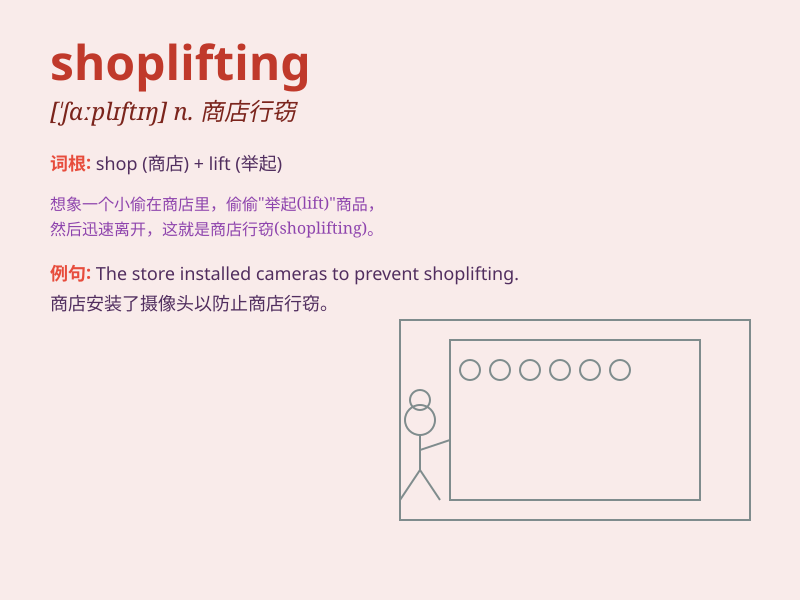

## shoplifting

**英音:** _[\'ʃɒplɪftɪŋ]_ **美音:** _[\'ʃɑp\'lɪftɪŋ]_

**译义:** *n.入店行窃*

### 短语

+ **commit shoplifting:** _实施商店行窃_

+ **prevent shoplifting:** _防止商店行窃_

+ **be caught shoplifting:** _被抓到商店行窃_

+ **shoplifting incident:** _商店行窃事件_

+ **shoplifting behavior:** _商店行窃行为_

### 例句

#### 例句1

> **The teenager was caught shoplifting at the local supermarket.**

**中文翻译:** 这名少年在当地超市行窃时被捕。

**单词释义:** 在商店行窃

#### 例句2

> **Shoplifting has become a serious problem in this shopping
district.**

**中文翻译:** 入店行窃已成为这个购物区的一个严重问题。

**单词释义:** 入店行窃

#### 例句3

> **She was arrested for shoplifting a pair of earrings.**

**中文翻译:** 她因在商店盗窃一对耳环而被捕。

**单词释义:** 商店扒窃

### 背诵小故事

> One day, Tom saw a person secretly taking things from a shop without
paying. The police came and said this was shoplifting, which is a bad
and illegal act. Tom learned that stealing from shops is not allowed.

**有一天，汤姆看到一个人偷偷地从商店里拿东西却不付钱。警察来了，说这是入店行窃，是一种不好且违法的行为。汤姆知道了从商店偷东西是不被允许的。**

### 图义

