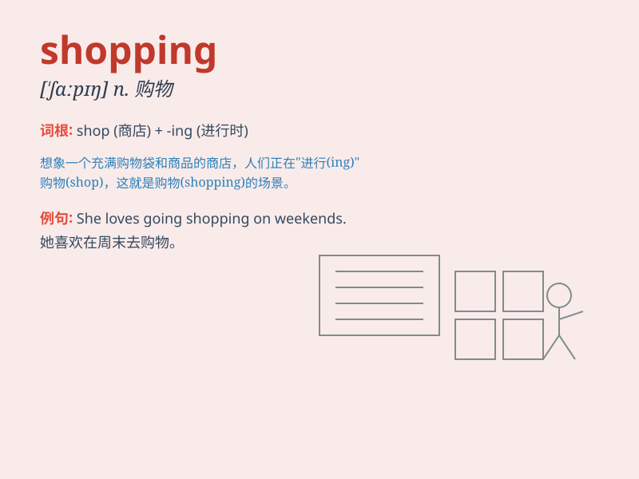

## shopping

**英音:** _[\'ʃɒpɪŋ]_ **美音:** _[\'ʃɑpɪŋ]_

**译义:** *n.买东西,购物*

### 短语

+ **shopping list:** _购物清单_

+ **shopping mall:** _大型购物中心_

+ **shopping cart:** _购物车_

+ **shopping spree:** _疯狂购物；抢购_

+ **online shopping:** _网上购物_

### 例句

#### 例句1

> **I enjoy shopping on weekends.**

**中文翻译:** 我喜欢周末购物。

**单词释义:** 购物

#### 例句2

> **She does a lot of shopping online.**

**中文翻译:** 她经常在网上购物。

**单词释义:** 购物

#### 例句3

> **Shopping for clothes can be fun.**

**中文翻译:** 买衣服可以很有趣。

**单词释义:** 购物

### 背诵小故事

> One day, Lily had a lot of fun shopping. She walked around the mall,
looking at various clothes and shoes. Finally, she found a beautiful
dress and a pair of comfortable shoes. Shopping made her very happy!

**有一天，莉莉购物非常开心。她在商场里到处逛，看各种各样的衣服和鞋子。最后，她找到了一条漂亮的裙子和一双舒适的鞋子。购物让她非常快乐！**

### 图义

