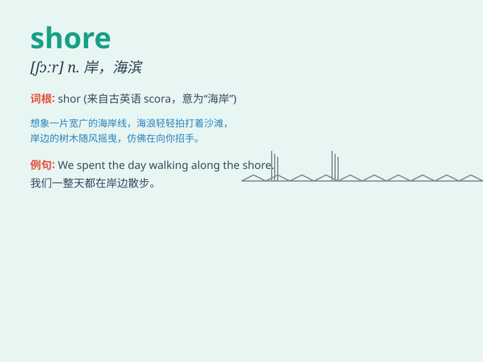

## shore

**英音:** _[ʃɔː]_ **美音:** _[ʃɔr]_

**译义:** *n.岸,海滨,支撑柱vt.支撑,支持*

### 短语

+ **off shore:** _离岸；在近海_

+ **shore up:** _支撑；支持；加固_

+ **sea shore:** _海岸；海滨_

+ **lake shore:** _湖岸_

+ **river shore:** _河岸_

### 例句

#### 例句1

> **The waves crashed against the shore.**

**中文翻译:** 海浪拍打着海岸。

**单词释义:** 海岸；海滨

#### 例句2

> **They swam to the shore.**

**中文翻译:** 他们游到了岸边。

**单词释义:** 岸；岸边

#### 例句3

> **The boat was pulled up onto the shore.**

**中文翻译:** 船被拉到岸边。

**单词释义:** 岸；陆地

### 背诵小故事

> A man was lost at sea. After days of drifting, he finally saw the
shore. He swam with all his strength and reached the land safely. The
shore was his salvation.

**一个男人在海上迷失了。经过数天的漂流，他终于看到了海岸。他用尽全身力气游过去，安全到达了陆地。海岸是他的救赎。**

### 图义

