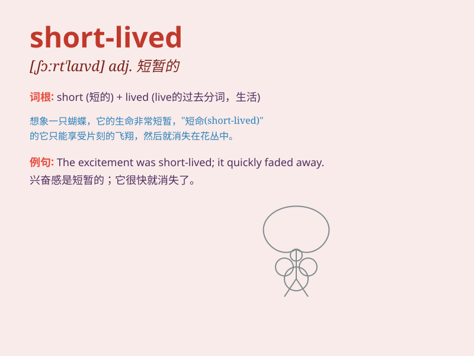

## short-lived

**英音:** _[ˈʃɔːt.lɪvd]_ **美音:** _[ˈʃɔrt.lɪvd]_

**译义:** *形容词，意思是寿命短的，存在时间不长的*

### 短语

+ **short-lived joy:** _短暂的快乐_

+ **short-lived success:** _短暂的成功_

+ **short-lived phenomenon:** _短暂的现象_

+ **short-lived romance:** _短暂的浪漫_

+ **short-lived enthusiasm:** _短暂的热情_

### 例句

#### 例句1

> **The flower\'s beauty was short-lived, as it wilted the next
day.**

**中文翻译:** 这朵花的美丽是短暂的，因为它第二天就枯萎了。

**单词释义:** 短暂的

#### 例句2

> **The short-lived celebration ended with bad news.**

**中文翻译:** 短暂的庆祝以坏消息告终。

**单词释义:** 短暂的

#### 例句3

> **His career as a pop star was short-lived but memorable.**

**中文翻译:** 他作为流行歌星的职业生涯短暂但令人难忘。

**单词释义:** 短暂的

### 背诵小故事

> A firefly has a short-lived life. It shines brightly in the night but
disappears quickly. Just like this, something short-lived lasts for a
very short time. 就像萤火虫，它在夜晚闪耀光芒，但很快消失。这就是
short-lived，短暂存在的。

**萤火虫的生命很短暂。它在夜晚闪耀，但很快就消失了。就像这样，short-lived
表示短暂存在的。**

### 图义

