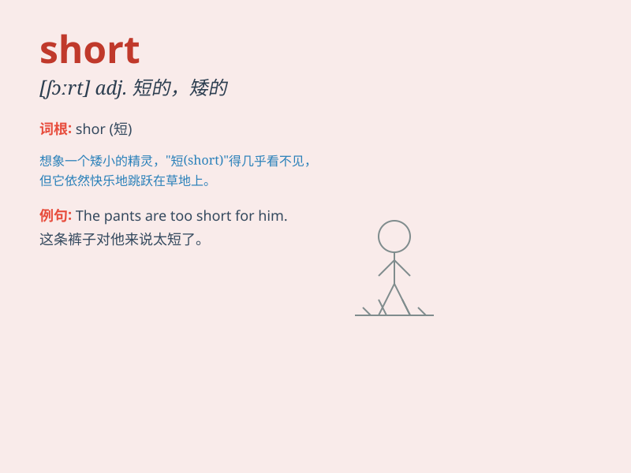

## short

**英音:** _[ʃɔːt]_ **美音:** _[ʃɔrt]_

**译义:**
*n.简略,短路,短裤adj.短的,矮的,不足的,不够的,(智力等)弱的,浅薄的,松脆的,简短adv.突然,缺乏,不足*

### 短语

+ **short of:** _缺乏；不足；未达到_

+ **in short:** _总之；简言之_

+ **short for:** _是......的简称；是......的缩写_

+ **short notice:** _临时通知；仓促通知_

+ **cut short:** _中断；缩短；打断_

### 例句

#### 例句1

> **He is short for his age.**

**中文翻译:** 就他的年龄而言，他身材矮小。

**单词释义:** 矮的；短的

#### 例句2

> **I have a short break at noon.**

**中文翻译:** 中午我有一个短暂的休息时间。

**单词释义:** 短暂的

#### 例句3

> **The skirt is too short for me.**

**中文翻译:** 裙子对我来说太短了。

**单词释义:** 短的

### 背诵小故事

> One day, Tom was in a hurry to catch the bus. But the line was too
long. He shouted, \'I need a short line!\' Finally, he got on the bus
just in time. It means lacking in length.

**一天，汤姆着急赶公交。但是队伍太长了。他喊道，'我需要短一点的队伍！'最后，他刚好赶上了公交。这个单词意思是长度不足。**

### 图义

