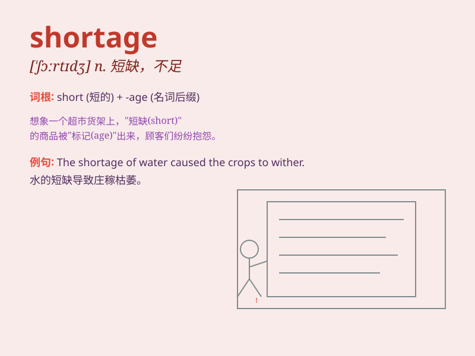

## shortage

**英音:** _[\'ʃɔːtɪdʒ]_ **美音:** _[\'ʃɔrtɪdʒ]_

**译义:** *n.不足,缺乏*

### 短语

+ **food shortage:** _食物短缺_

+ **water shortage:** _水资源短缺_

+ **shortage of funds:** _资金短缺_

+ **shortage of workers:** _工人短缺_

+ **shortage of resources:** _资源短缺_

### 例句

#### 例句1

> **There is a shortage of food in the disaster area.**

**中文翻译:** 灾区粮食短缺。

**单词释义:** 短缺

#### 例句2

> **The company is facing a shortage of skilled workers.**

**中文翻译:** 该公司正面临技术工人短缺的问题。

**单词释义:** 短缺

#### 例句3

> **A shortage of water has affected the crops.**

**中文翻译:** 缺水影响了农作物。

**单词释义:** 短缺

### 背诵小故事

> In a small town, there was always a shortage of water. People had to
save every drop. One day, a wise man found a new source and solved the
problem. Now they had enough water, and \'shortage\' became a lesson
they\'d never forget.

**在一个小镇，一直存在着水资源短缺的情况。人们必须节约每一滴水。有一天，一位智者找到了新的水源解决了问题。现在他们有了足够的水，'shortage'（短缺）成了他们永远不会忘记的一课。**

### 图义

