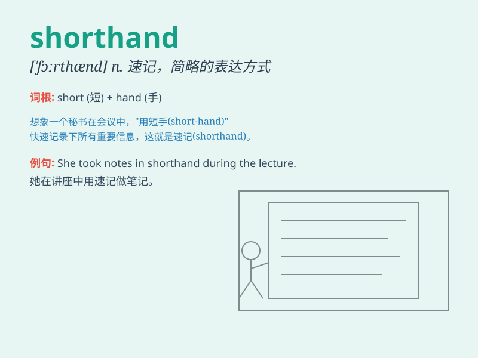

## shorthand

**英音:** _[\'ʃɔːthænd]_ **美音:** _[\'ʃɔrthænd]_

**译义:** *n.速记*

### 短语

+ **shorthand writing:** _速记写作_

+ **shorthand system:** _速记系统_

+ **learn shorthand:** _学习速记_

+ **shorthand note:** _速记笔记_

+ **use shorthand:** _使用速记_

### 例句

#### 例句1

> **She took notes in shorthand during the meeting.**

**中文翻译:** 她在会议期间速记笔记。

**单词释义:** 速记

#### 例句2

> **The secretary was skilled in shorthand and could transcribe
quickly.**

**中文翻译:** 秘书速记熟练，抄写得很快。

**单词释义:** 速记

#### 例句3

> **I can\'t read shorthand, it\'s too complicated for me.**

**中文翻译:** 我看不懂速记，这对我来说太复杂了。

**单词释义:** 速记

### 背诵小故事

> One day, a journalist was in a hurry to take notes. Instead of
writing everything in full, he used shorthand, a quick and abbreviated
way of writing. This helped him save time and record all the important
points easily.

**有一天，一位记者匆忙做笔记。他没有完整地写下所有内容，而是使用了速记，一种快速和简略的书写方式。这帮助他节省了时间，并轻松记录了所有重要的要点。**

### 图义

