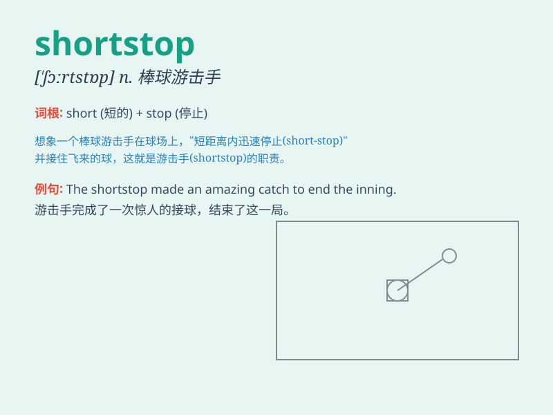

## shortstop

**英音:** _[\'ʃɔːtstɒp]_ **美音:** _[\'ʃɔrt,stɑp]_

**译义:** *n.游击,速显液*

### 短语

+ **baseball shortstop:** _棒球游击手_

+ **professional shortstop:** _职业游击手_

+ **talented shortstop:** _有天赋的游击手_

+ **experienced shortstop:** _经验丰富的游击手_

+ **outstanding shortstop:** _杰出的游击手_

### 例句

#### 例句1

> **The shortstop made an amazing catch to prevent the runner from
advancing.**

**中文翻译:** 游击手完成了一次惊人的接球，阻止了跑步者的前进。

**单词释义:** 游击手（棒球运动中的一个位置）

#### 例句2

> **He dreams of becoming a professional shortstop one day.**

**中文翻译:** 他梦想有一天成为一名职业游击手。

**单词释义:** 游击手

#### 例句3

> **The shortstop\'s quick reflexes saved the game.**

**中文翻译:** 游击手的快速反应挽救了比赛。

**单词释义:** 游击手

### 背诵小故事

> In a baseball game, the shortstop is a key player. One day, a young
player was assigned as the shortstop. He was short but very agile. He
stopped many balls and saved the game. So, remember shortstop as the
agile player who stops the balls.

**在一场棒球比赛中，游击手是关键球员。有一天，一位个子不高但很敏捷的年轻球员被安排为游击手。他拦住了很多球并拯救了比赛。所以，记住
shortstop 就是那个敏捷拦球的球员。**

### 图义

