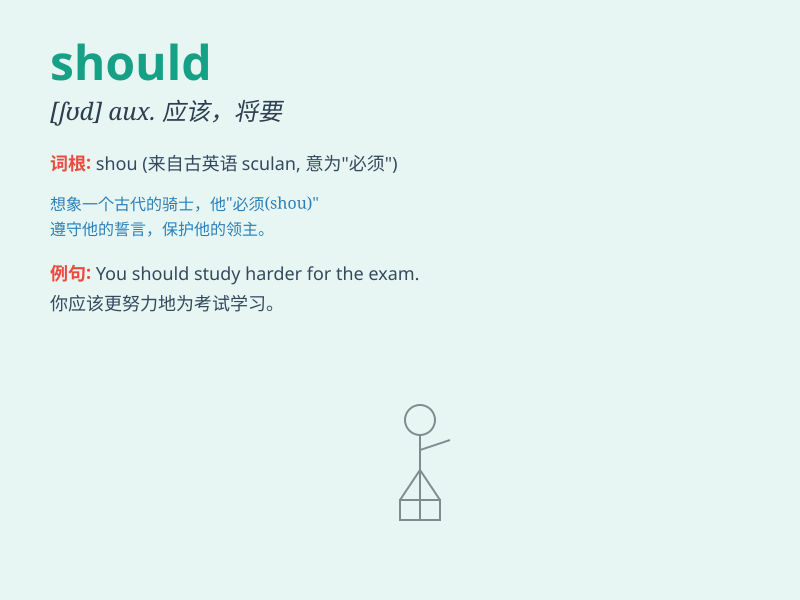

## should

**英音:** _[ʃəd; strong form ʃʊd]_ **美音:** _[ʃəd; strong
form ʃʊd]_

**译义:** *v.aux.应该,将要*

### 短语

+ **should have done:** _本应该做某事（但实际上未做）_

+ **should not have done:** _本不应该做某事（但实际上做了）_

+ **should do:** _应该做_

+ **why should I:** _为什么我应该_

+ **should be:** _应该是_

### 例句

#### 例句1

> **You should study hard for the exam.**

**中文翻译:** 你应该努力学习以准备考试。

**单词释义:** 应该

#### 例句2

> **He should apologize for his mistake.**

**中文翻译:** 他应该为自己的错误道歉。

**单词释义:** 应该

#### 例句3

> **We should arrive at the airport before 8 o\'clock.**

**中文翻译:** 我们应该在八点之前到达机场。

**单词释义:** 应该

### 背诵小故事

> One day, a little boy wanted to play outside but it was raining. His
mom said, \'You should stay at home.\' The boy understood that should
means it\'s the right or proper thing to do.

**一天，一个小男孩想出去玩，但天在下雨。他妈妈说：'你应该待在家里。'男孩明白了
should 意味着是正确或恰当的事情。**

### 图义

