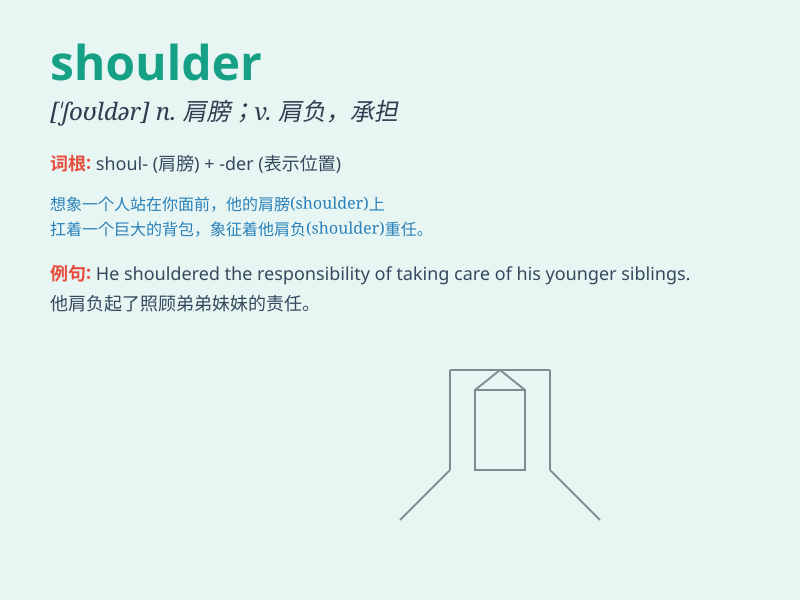

## shoulder

**英音:** _[\'ʃəʊldə]_ **美音:** _[\'ʃoldɚ]_

**译义:** *n.肩,肩部,侧翼vt.肩负,承当*

### 短语

+ **shoulder to shoulder:** _并肩；肩并肩_

+ **cry on someone\'s shoulder:**
_向某人倾诉苦衷；靠在某人肩上哭泣_

+ **shoulder the blame:** _承担责任；负咎_

+ **shoulder the burden:** _承担负担；肩负重任_

+ **cold shoulder:** _冷淡对待；轻视_

### 例句

#### 例句1

> **She carried a heavy bag on her shoulder.**

**中文翻译:** 她肩上背着一个沉重的包。

**单词释义:** 肩膀

#### 例句2

> **He shouldered the responsibility of taking care of his elderly
parents.**

**中文翻译:** 他肩负起照顾年迈父母的责任。

**单词释义:** 承担；担负

#### 例句3

> **The soldier shouldered his rifle and marched on.**

**中文翻译:** 士兵扛起步枪继续前行。

**单词释义:** 扛；背

### 背诵小故事

> One day, a little boy was carrying a heavy bag. His arms got tired,
but then he remembered he had strong shoulders. So, he used his
shoulders to hold the bag and continued walking easily. The shoulders
helped him a lot!

**有一天，一个小男孩提着一个沉重的包。他的胳膊累了，但随后他想起自己有强壮的肩膀。于是，他用肩膀扛着包，轻松地继续走。肩膀帮了他大忙！**

### 图义

