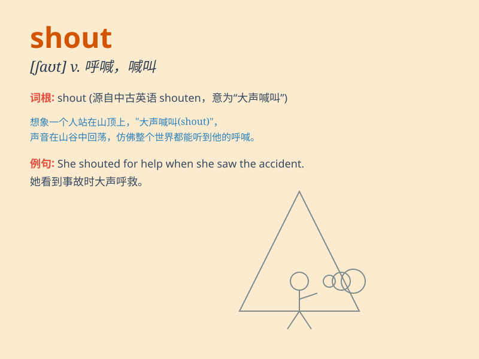

## shout

**英音:** _[ʃaʊt]_ **美音:** _[ʃaʊt]_

**译义:** *v.呼喊,呼叫n.呼喊,呼叫*

### 短语

+ **shout at:** _对\...\...大声叫嚷_

+ **shout out:** _大声呼喊；喊出_

+ **shout for help:** _大声呼救_

+ **give a shout:** _大喊一声_

+ **shout down:** _大声喝止；以大声喊叫压倒_

### 例句

#### 例句1

> **She shouted for help when she saw the thief.**

**中文翻译:** 当她看到小偷时，她大声呼救。

**单词释义:** 大声呼喊

#### 例句2

> **Don\'t shout at me! I\'m not a child.**

**中文翻译:** 别对我大喊大叫！我不是孩子。

**单词释义:** 冲\...\...喊叫

#### 例句3

> **The football fans shouted excitedly when their team scored a
goal.**

**中文翻译:** 当他们的球队进球时，球迷们兴奋地欢呼起来。

**单词释义:** 大声叫嚷

### 背诵小故事

> One day, Tom was lost in a forest. He felt scared and started to
shout loudly for help. His shout echoed through the trees. Finally, a
ranger heard his shout and found him.

**有一天，汤姆在森林里迷路了。他感到害怕，开始大声呼喊求救。他的呼喊声在树林中回荡。最后，一位护林员听到了他的呼喊并找到了他。**

### 图义

