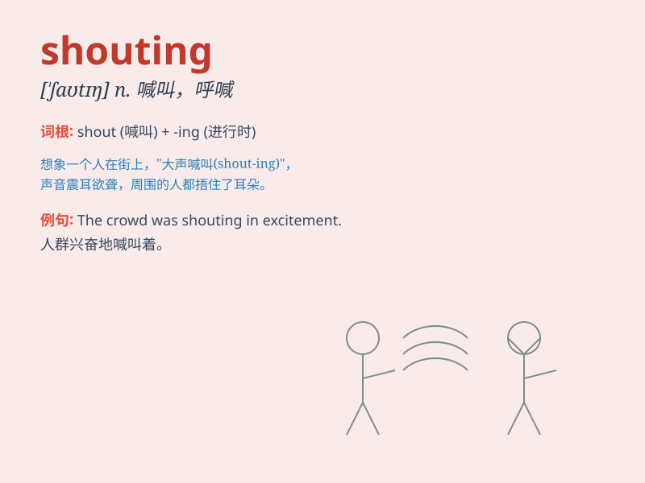

## shouting

**英音:** _[\'ʃəʊtɪŋ]_ **美音:** _[\'ʃaʊtɪŋ]_

**译义:** *大喊大叫,在电子信件中全部用大写字母*

### 短语

+ **shouting match:** _大声争吵；激烈争吵_

+ **shouting distance:** _在呼喊距离之内；不远处_

+ **stop shouting:** _停止呼喊_

+ **keep shouting:** _一直呼喊_

+ **shouting loudly:** _大声喊叫_

### 例句

#### 例句1

> **The children were shouting with excitement in the playground.**

**中文翻译:** 操场上，孩子们兴奋地喊叫着。

**单词释义:** 大喊大叫

#### 例句2

> **Stop shouting or you\'ll wake the baby.**

**中文翻译:** 别再喊了，不然你会吵醒宝宝的。

**单词释义:** 大声喊叫

#### 例句3

> **I could hear someone shouting for help from the distance.**

**中文翻译:** 我听见远处有人喊救命。

**单词释义:** 大声呼喊

### 背诵小故事

> One day, I was in the park. Suddenly, I heard a lot of shouting. I
ran to see and found two kids arguing loudly over a toy. Their shouting
attracted many people\'s attention.

**有一天，我在公园。突然，我听到很多叫喊声。我跑过去看，发现两个孩子为一个玩具大声争吵。他们的叫喊吸引了很多人的注意。**

### 图义

