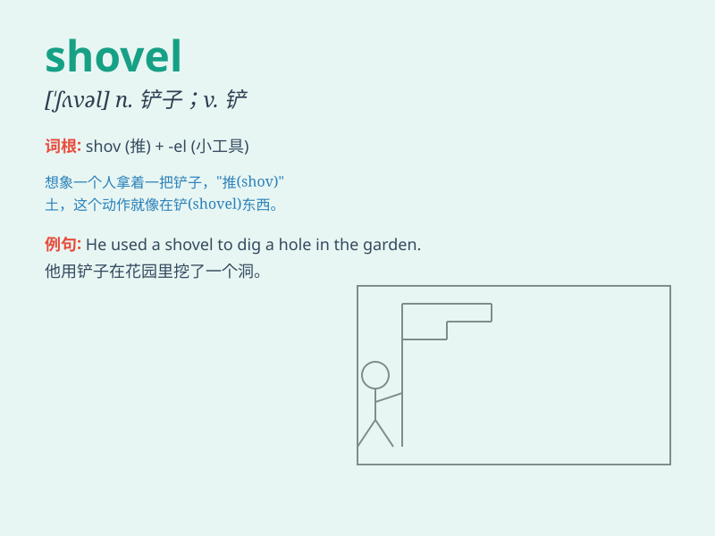

## shovel

**英音:** _[\'ʃʌv(ə)l]_ **美音:** _[\'ʃʌvl]_

**译义:** *n.铲,铁铲v.铲*

### 短语

+ **shovel snow:** _铲雪_

+ **shovel coal:** _铲煤_

+ **power shovel:** _动力铲；电铲_

+ **shovel sth. into:** _把某物铲入_

+ **shovel sth. out:** _把某物铲出_

### 例句

#### 例句1

> **He used a shovel to dig a hole in the garden.**

**中文翻译:** 他用铲子在花园里挖了一个洞。

**单词释义:** 铲子（用作名词，表示一种工具）

#### 例句2

> **The workers were shoveling snow off the road.**

**中文翻译:** 工人们正在铲除路上的积雪。

**单词释义:** 铲（用作动词，表示动作）

#### 例句3

> **She shoveled the coal into the furnace.**

**中文翻译:** 她把煤铲进炉子里。

**单词释义:** 铲（用作动词，表示动作）

### 背诵小故事

> One day, a worker was using a shovel to dig in the garden. The shovel
was heavy but useful. It helped him move a lot of soil quickly. With the
shovel, the work became much easier.

**一天，一个工人正在花园里用铲子挖土。铲子很重但很有用。它帮助他快速移动了大量的泥土。有了铲子，工作变得容易多了。**

### 图义

