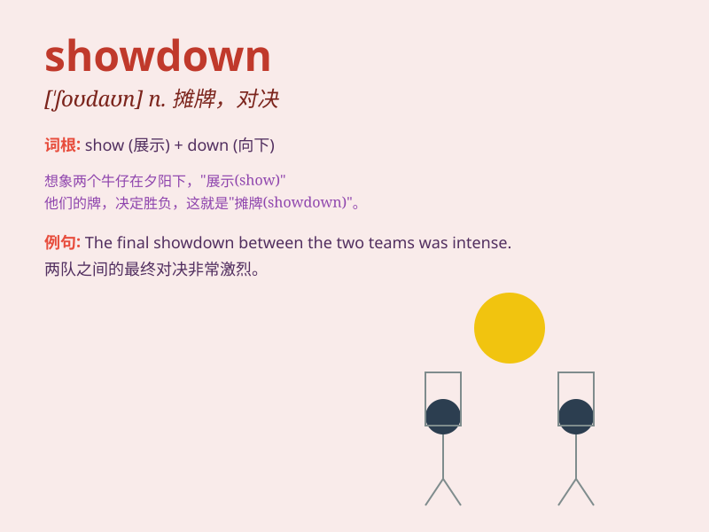

## showdown

**英音:** _[\'ʃəʊdaʊn]_ **美音:** _[\'ʃodaʊn]_

**译义:** *n.摊牌*

### 短语

+ **final showdown:** _最终对决_

+ **showdown between:** _在\...\...之间的摊牌_

+ **political showdown:** _政治摊牌_

+ **armed showdown:** _武装对决_

+ **showdown with:** _与\...\...的对决_

### 例句

#### 例句1

> **The two boxers are preparing for a final showdown.**

**中文翻译:** 两位拳击手正在为最后的对决做准备。

**单词释义:** 决战；摊牌

#### 例句2

> **There will be a political showdown between the two parties next
month.**

**中文翻译:** 下个月两党之间将进行政治摊牌。

**单词释义:** 摊牌；对决

#### 例句3

> **The showdown between the detective and the criminal was
intense.**

**中文翻译:** 侦探与罪犯之间的对决非常激烈。

**单词释义:** 对决；交锋

### 背诵小故事

> In a wild west town, two gunmen faced each other for a final
showdown. The tension was high as they prepared to draw their guns and
decide the winner. It was a moment of ultimate confrontation.

**在一个西部荒野小镇，两名枪手彼此对峙，准备进行最后的对决。气氛紧张，他们准备拔枪决出胜负。这是终极对抗的时刻。**

### 图义

