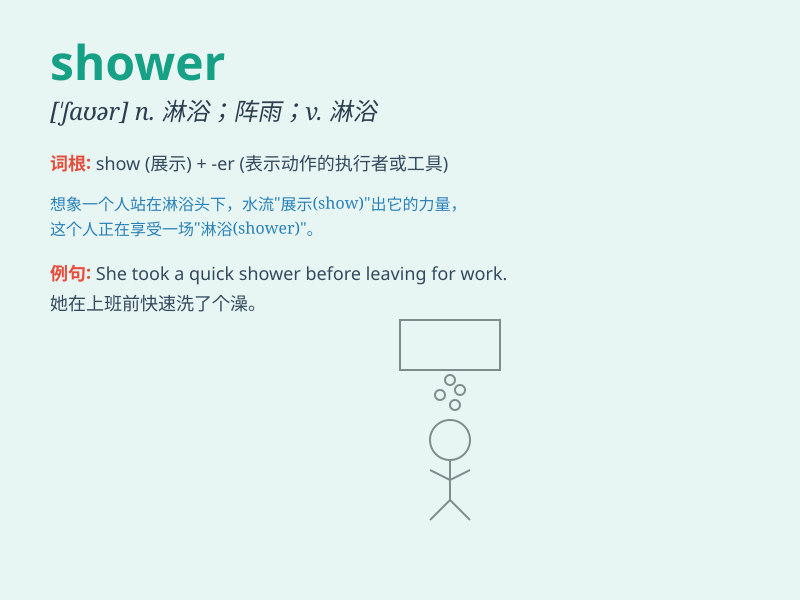

## shower

**英音:** _[\'ʃaʊə]_ **美音:** _[\'ʃaʊɚ]_

**译义:** *n.阵雨,淋浴,(一)阵,(一)大批vt.大量地给与*

### 短语

+ **shower gel:** _沐浴露_

+ **shower room:** _淋浴间_

+ **meteor shower:** _流星雨_

+ **shower curtain:** _浴帘_

+ **baby shower:** _迎婴派对_

### 例句

#### 例句1

> **I take a shower every morning.**

**中文翻译:** 我每天早上都会洗澡。

**单词释义:** 淋浴；洗澡

#### 例句2

> **The shower of rain came suddenly.**

**中文翻译:** 倾盆大雨突然降临。

**单词释义:** 阵雨；阵雪

#### 例句3

> **She received a shower of gifts on her birthday.**

**中文翻译:** 她在生日那天收到了一大堆礼物。

**单词释义:** 一大批；大量

### 背诵小故事

> One day, I was really dirty after playing outside. So, I went into
the bathroom and turned on the shower. The water came down like a gentle
rain, cleaning me up. It was such a refreshing shower!

**有一天，我在外面玩得浑身脏兮兮的。于是，我走进浴室，打开淋浴喷头。水像温柔的雨一样落下来，把我洗干净了。这真是一场令人神清气爽的淋浴！**

### 图义

