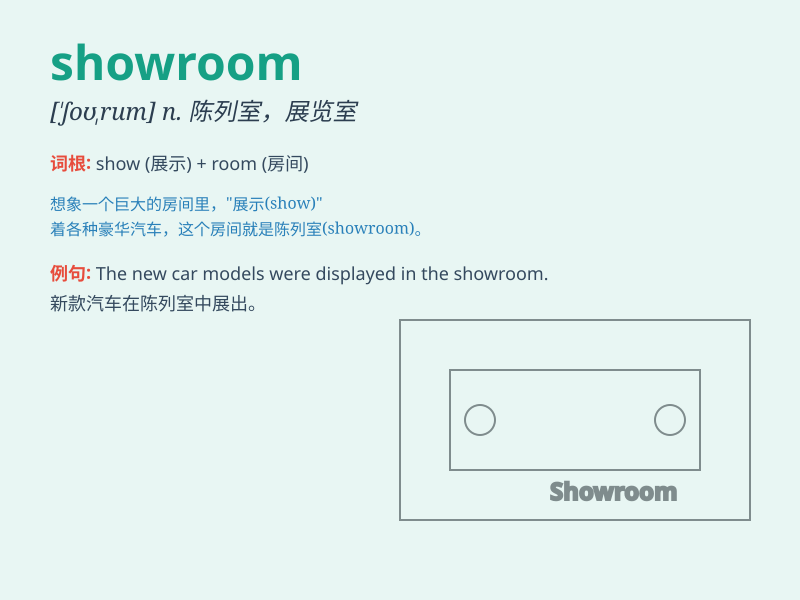

## showroom

**英音:** _[\'ʃəʊruːm; -rʊm]_ **美音:** _[\'ʃorʊm]_

**译义:** *n.(商品样品的)陈列室*

### 短语

+ **car showroom:** _汽车展厅_

+ **furniture showroom:** _家具陈列室_

+ **showroom model:** _展厅模型_

+ **visit the showroom:** _参观展厅_

+ **new showroom:** _新展厅_

### 例句

#### 例句1

> **The new car showroom was filled with the latest models.**

**中文翻译:** 新车展厅里摆满了最新车型。

**单词释义:** 展示厅；陈列室

#### 例句2

> **We visited the furniture showroom to choose a sofa.**

**中文翻译:** 我们参观了家具陈列室挑选沙发。

**单词释义:** 陈列室

#### 例句3

> **The fashion showroom showcased the designer\'s latest
collection.**

**中文翻译:** 时装陈列室展示了设计师的最新系列。

**单词释义:** 展示厅

### 背诵小故事

> A young designer was very nervous when presenting her new collection
in the showroom. But when the lights came on and the models walked out,
everything was perfect. The showroom became a stage of dreams.

**一位年轻的设计师在陈列室展示她的新系列时非常紧张。但当灯光亮起，模特走出来时，一切都很完美。这个陈列室变成了梦想的舞台。**

### 图义

