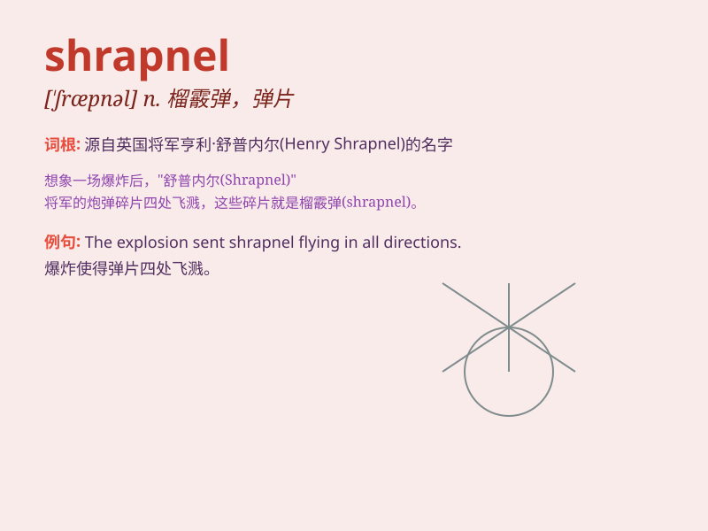

## shrapnel

**英音:** _[\'ʃræpn(ə)l]_ **美音:** _[\'sræpnəl]_

**译义:** *n.榴散弹*

### 短语

+ **shrapnel wound:** _弹片伤_

+ **shrapnel damage:** _弹片造成的破坏_

+ **shrapnel explosion:** _弹片爆炸_

+ **shrapnel fragment:** _弹片碎片_

+ **shrapnel hazard:** _弹片危险_

### 例句

#### 例句1

> **The soldier was injured by shrapnel during the battle.**

**中文翻译:** 这名士兵在战斗中被弹片炸伤。

**单词释义:** 弹片

#### 例句2

> **The explosion sent shrapnel flying in all directions.**

**中文翻译:** 爆炸使弹片向四面八方飞溅。

**单词释义:** 弹片

#### 例句3

> **He was hit by shrapnel and lost consciousness.**

**中文翻译:** 他被弹片击中并失去了知觉。

**单词释义:** 弹片

### 背诵小故事

> A soldier was in a fierce battle. Suddenly, an explosion occurred,
and shrapnel flew everywhere. The soldier was lucky to escape unhurt.
Shrapnel is the dangerous pieces of metal from an explosion.

**一名士兵正在激烈的战斗中。突然，发生了爆炸，弹片四处飞溅。这名士兵幸运地毫发无损地逃脱了。弹片就是爆炸产生的危险金属碎片。**

### 图义

