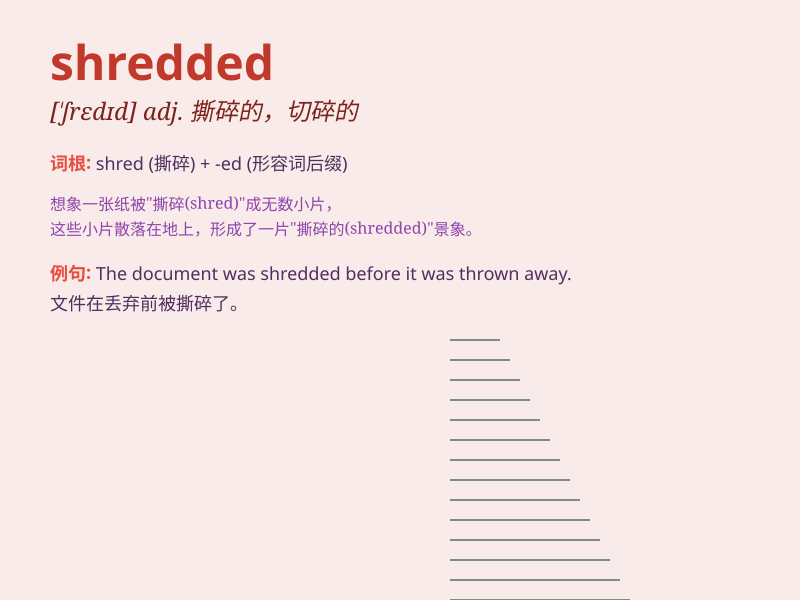

## shredded

**英音:** _[ʃredɪd]_ **美音:** _[ʃredɪd]_

**译义:** *adj. 撕碎的，切碎的；切成细条的（shred
的过去分词形式）*

### 短语

+ **shredded cheese:** _切碎的奶酪_

+ **shredded paper:** _碎纸_

+ **shredded chicken:** _鸡丝_

+ **shredded cabbage:** _卷心菜丝_

+ **shredded beef:** _牛肉丝_

### 例句

#### 例句1

> **The chef shredded the carrots for the salad.**

**中文翻译:** 厨师把胡萝卜切碎做沙拉。

**单词释义:** 切碎

#### 例句2

> **I found shredded paper all over the floor.**

**中文翻译:** 我发现地板上到处都是碎纸。

**单词释义:** 被切碎的

#### 例句3

> **She shredded the documents to keep them confidential.**

**中文翻译:** 她把文件切碎以保证其机密性。

**单词释义:** 切碎

### 背诵小故事

> One day, I was helping in the kitchen. I saw mom shredded the cabbage
into thin strips. The shredded cabbage looked so fine and ready for a
delicious salad.

**有一天，我在厨房帮忙。我看到妈妈把卷心菜切成了细条。这些切碎的卷心菜看起来很棒，准备用来做美味的沙拉。**

### 图义

