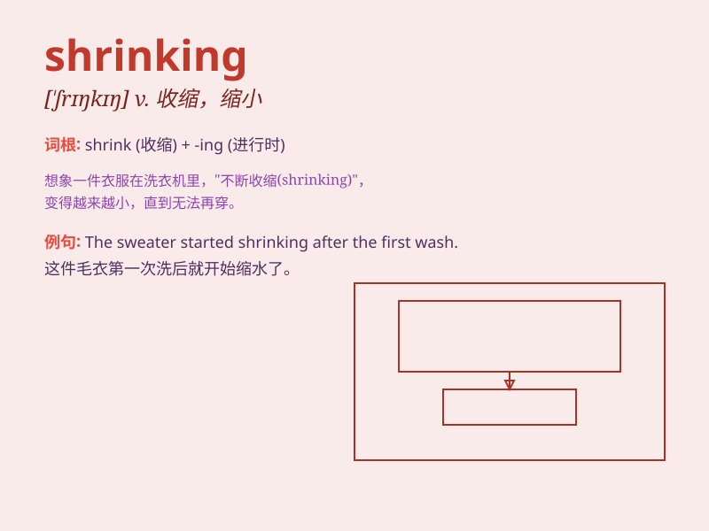

## shrinking

**英音:** _[ˈʃrɪŋkɪŋ]_ **美音:** _[ˈʃrɪŋkɪŋ]_

**译义:** *v.收缩，缩小（shrink的现在分词形式）；退缩，畏缩*

### 短语

+ **shrinking violet:** _羞怯的人；畏首畏尾的人_

+ **shrinking market:** _萎缩的市场_

+ **shrinking economy:** _萎缩的经济_

+ **shrinking population:** _人口减少_

+ **shrinking supply:** _供应减少_

### 例句

#### 例句1

> **The economy is shrinking, causing widespread unemployment.**

**中文翻译:** 经济正在萎缩，导致了大范围的失业。

**单词释义:** 萎缩；收缩

#### 例句2

> **The shirt is shrinking after being washed several times.**

**中文翻译:** 这件衬衫洗了几次后缩水了。

**单词释义:** 缩水；变小

#### 例句3

> **The company\'s market share is shrinking due to fierce
competition.**

**中文翻译:** 由于激烈的竞争，公司的市场份额正在缩小。

**单词释义:** 缩小；减少

### 背诵小故事

>
想象一下，有一块神奇的海绵，每次放进水里就会变小，这个不断变小的过程就是\'shrinking\'。就像我们的衣服洗了会缩水，也是\'shrinking\'的表现。

**想象一块海绵不断变小的过程来理解\'shrinking\'，意思是收缩、缩小。**

### 图义

