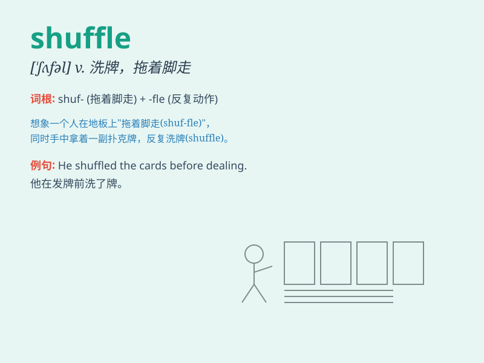

## shuffle

**英音:** _[\'ʃʌf(ə)l]_ **美音:** _[\'ʃʌfl]_

**译义:**
*n.拖着脚走,混乱,蒙混,洗纸牌v.拖曳,搅乱,慢吞吞地走,推诿,洗牌*

### 短语

+ **shuffle along:** _拖着脚走_

+ **shuffle through:** _草草翻阅_

+ **shuffle off:** _摆脱；推卸_

+ **shuffle around:** _到处乱走_

+ **shuffle the cards:** _洗牌_

### 例句

#### 例句1

> **He shuffled the cards before dealing them.**

**中文翻译:** 他在发牌之前先洗牌。

**单词释义:** 洗牌

#### 例句2

> **She shuffled along the corridor in her slippers.**

**中文翻译:** 她穿着拖鞋拖着脚步在走廊里走着。

**单词释义:** 拖着脚走

#### 例句3

> **The government keeps shuffling its ministers around.**

**中文翻译:** 政府不断地更换部长。

**单词释义:** 调动

### 背诵小故事

> One day, a magician was doing a trick. He asked an audience to
shuffle a deck of cards. The audience mixed the cards randomly, and this
action was called \'shuffle\'.

**有一天，一位魔术师正在表演魔术。他让一位观众打乱一副牌。观众随意地混合这些牌，这个动作就叫做'shuffle（洗牌，弄乱）'。**

### 图义

