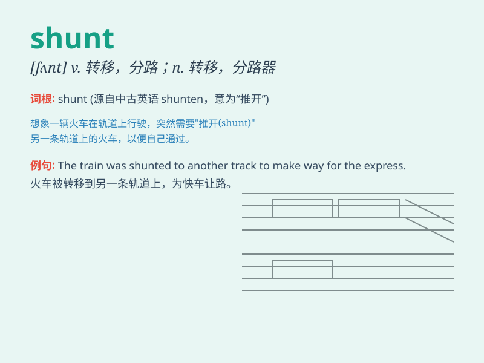

## shunt

**英音:** _[ʃʌnt]_ **美音:** _[ʃʌnt]_

**译义:** *v.逃避*

### 短语

+ **shunt capacitor:** _并联电容器_

+ **shunt resistor:** _分流电阻器_

+ **arteriovenous shunt:** _动静脉分流_

+ **shunt operation:** _分流手术_

+ **shunt current:** _分流电流_

### 例句

#### 例句1

> **The train was shunted onto a siding.**

**中文翻译:** 火车被调到一条支线上。

**单词释义:** 调往；使（火车）转轨

#### 例句2

> **Doctors decided to shunt the blood flow away from the damaged
area.**

**中文翻译:** 医生决定将血流从受损区域分流出去。

**单词释义:** 使（血液等）分流

#### 例句3

> **He was shunted aside in the promotion process.**

**中文翻译:** 他在晋升过程中被排挤到一边。

**单词释义:** 把\...撇在一边；冷落

### 背诵小故事

> 想象一下，在繁忙的火车站，一辆火车需要从主轨道 shunt
到旁边的支线轨道，以便让其他列车通过。工作人员迅速操作，成功完成了 shunt
这个动作，确保了铁路运输的顺畅。

**想象在火车站，火车从主轨道转到支线轨道的动作叫'分流；使转轨'**

### 图义

