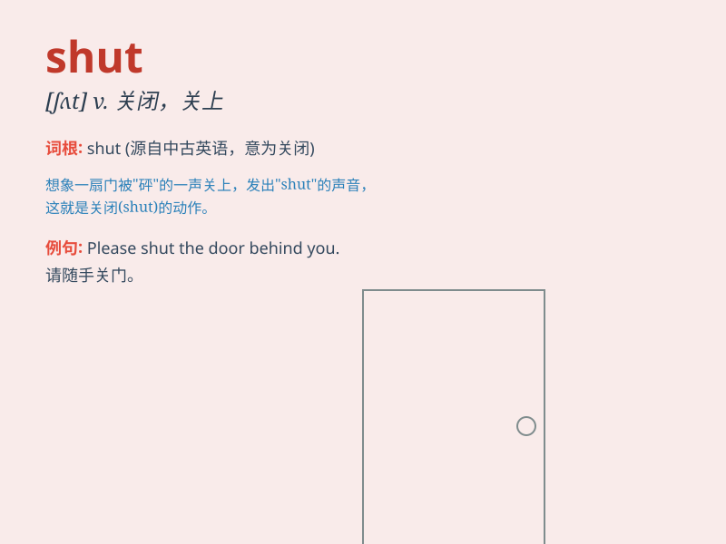

## shut

**英音:** _[ʃʌt]_ **美音:** _[ʃʌt]_

**译义:** *v.关上,闭上,关闭*

### 短语

+ **shut down:** _关闭；停工；停业_

+ **shut up:** _闭嘴；住口_

+ **shut in:** _把...关在里面；围住_

+ **shut out:** _把...关在外面；排斥_

+ **shut off:** _切断；关掉_

### 例句

#### 例句1

> **Please shut the door when you leave.**

**中文翻译:** 离开时请随手关门。

**单词释义:** 关闭

#### 例句2

> **The shop shuts at 6 pm every day.**

**中文翻译:** 商店每天下午 6 点关门。

**单词释义:** （商店等）关门

#### 例句3

> **She shut her eyes tightly.**

**中文翻译:** 她紧紧地闭上了眼睛。

**单词释义:** 闭上

### 背诵小故事

> One day, I was in a hurry to leave my room and shut the door hard.
But then I realized I forgot my keys inside. Shut means to close
something firmly and prevent it from opening.

**有一天，我匆忙离开房间并用力关上了门。但随后我意识到我把钥匙忘在里面了。shut
意思是紧紧关闭某物并防止其打开。**

### 图义

