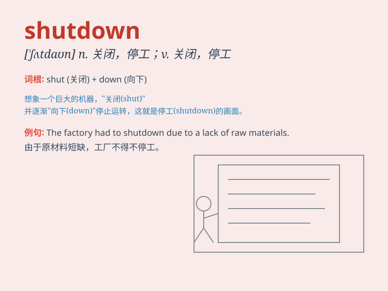

## shutdown

**英音:** _[\'ʃʌtdaʊn]_ **美音:** _[\'ʃʌtdaʊn]_

**译义:** *n.关门,停工,(广播电台)停播(时间)*

### 短语

+ **system shutdown:** _系统关闭_

+ **factory shutdown:** _工厂停工_

+ **emergency shutdown:** _紧急关闭_

+ **partial shutdown:** _部分关闭_

+ **shutdown procedure:** _关闭程序_

### 例句

#### 例句1

> **The factory had to undergo a sudden shutdown due to a major
equipment failure.**

**中文翻译:** 由于重大设备故障，工厂不得不突然停工。

**单词释义:** 停工；关闭

#### 例句2

> **The government ordered a complete shutdown of non-essential
businesses during the pandemic.**

**中文翻译:** 政府下令在大流行期间完全关闭非必要企业。

**单词释义:** 关闭；停业

#### 例句3

> **The computer system experienced a shutdown, and we lost all the
unsaved data.**

**中文翻译:** 计算机系统关闭，我们丢失了所有未保存的数据。

**单词释义:** （机器或系统的）关闭；停机

### 背诵小故事

>
想象一个工厂，机器轰鸣，工人们忙碌。突然，老板宣布要进行\'shutdown\'，停止所有生产。灯光熄灭，机器停止，大家都安静下来，这就是\'shutdown\'，意味着关闭、停工。

**想象一个工厂，突然老板宣布停工，灯光熄灭机器停止，这就是 shutdown
关闭、停工的意思**

### 图义

