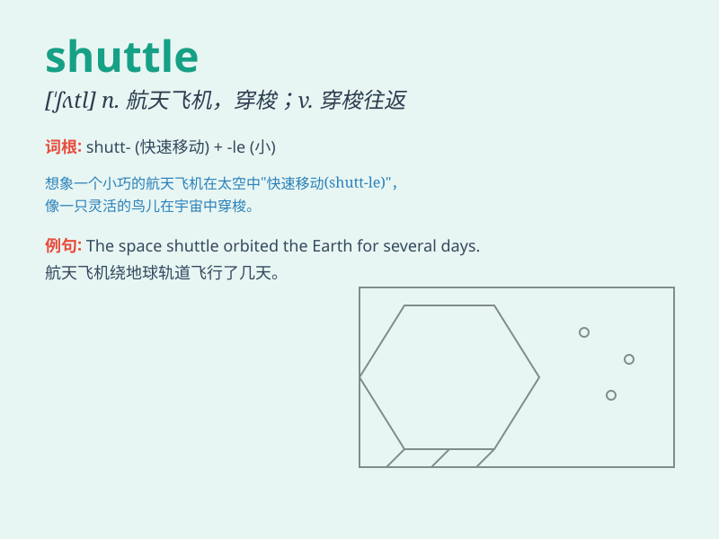

## shuttle

**英音:** _[\'ʃʌt(ə)l]_ **美音:** _[\'ʃʌtl]_

**译义:** *n.往返汽车(列车、飞机),航天飞机,梭子,穿梭v.穿梭往返*

### 短语

+ **space shuttle:** _航天飞机_

+ **shuttle bus:** _班车；区间巴士_

+ **shuttle service:** _穿梭服务；往返服务_

+ **shuttle diplomacy:** _穿梭外交_

+ **shuttle trade:** _穿梭贸易_

### 例句

#### 例句1

> **The shuttle bus runs between the hotel and the airport every
hour.**

**中文翻译:** 酒店和机场之间每小时有一班班车。

**单词释义:** 穿梭巴士

#### 例句2

> **The space shuttle returned safely to Earth.**

**中文翻译:** 航天飞机安全返回地球。

**单词释义:** 航天飞机

#### 例句3

> **She shuttled between the different departments to gather
information.**

**中文翻译:** 她穿梭于不同部门之间收集信息。

**单词释义:** 穿梭

### 背诵小故事

> A little bird was constantly shuttling between two trees, carrying
small twigs to build its nest. It moved back and forth quickly, just
like a shuttle. The bird\'s busy movement helped me remember the word
\'shuttle\' which means to move frequently between two places.

**一只小鸟不停地在两棵树之间穿梭，叼着小树枝来筑巢。它快速地来回移动，就像梭子一样。小鸟忙碌的动作帮助我记住了'shuttle'这个词，它的意思是在两个地方之间频繁移动。**

### 图义

