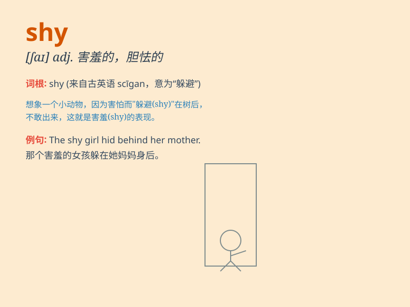

## shy

**英音:** _[ʃaɪ]_ **美音:** _[ʃaɪ]_

**译义:** *adj.怕羞的,畏缩的,害羞的*

### 短语

+ **be shy of:** _畏缩；羞于_

+ **shy away from:** _回避；退缩_

+ **fight shy of:** _回避；躲避_

+ **shy person:** _害羞的人_

+ **shy smile:** _羞涩的微笑_

### 例句

#### 例句1

> **She is too shy to speak in public.**

**中文翻译:** 她太害羞了，以至于不敢在公众场合发言。

**单词释义:** 害羞的；胆怯的

#### 例句2

> **The horse shied at the sudden noise.**

**中文翻译:** 那匹马因突然的响声而惊退。

**单词释义:** 惊退；畏缩

#### 例句3

> **He was shy of lending money to strangers.**

**中文翻译:** 他不愿意借钱给陌生人。

**单词释义:** 对......有顾虑；畏缩

### 背诵小故事

> 从前有只小兔子，它很 shy
，每次见到陌生人就躲起来。有一天，它鼓起勇气参加了森林聚会，虽然还是有点害羞，但它迈出了勇敢的一步。最终，它不再那么
shy ，能大方地和大家一起玩耍了。

**从前有一只小兔子，它很害羞，每次见到陌生人就躲起来。有一天，它鼓起勇气参加了森林聚会，虽然还是有点害羞，但它迈出了勇敢的一步。最终，它不再那么害羞，能大方地和大家一起玩耍了。**

### 图义

