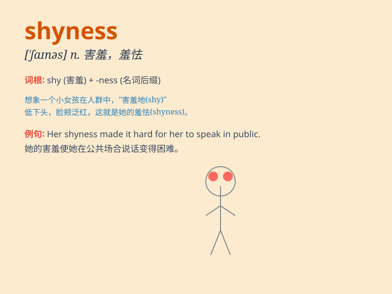

## shyness

**英音:** _[\'ʃaɪnɪs]_ **美音:** _[\'ʃaɪnɪs]_

**译义:** *n.羞怯,胆怯*

### 短语

+ **overcome shyness:** _克服羞怯_

+ **suffer from shyness:** _受羞怯之苦_

+ **show shyness:** _表现出羞怯_

+ **hide shyness:** _隐藏羞怯_

+ **deal with shyness:** _处理羞怯_

### 例句

#### 例句1

> **Her shyness prevented her from speaking up in the meeting.**

**中文翻译:** 她的羞怯使她在会议上不敢发言。

**单词释义:** 羞怯；害羞

#### 例句2

> **Despite his shyness, he managed to make some friends at the new
school.**

**中文翻译:** 尽管他很害羞，但他还是在新学校交到了一些朋友。

**单词释义:** 害羞；胆怯

#### 例句3

> **Overcoming shyness is a long and challenging process.**

**中文翻译:** 克服羞怯是一个漫长而具有挑战性的过程。

**单词释义:** 羞怯；畏缩

### 背诵小故事

> Once upon a time, there was a little rabbit. It always hid behind a
tree when meeting others. Its shyness made it afraid to make friends.
But with time and courage, it overcame this and became more confident.

**从前，有一只小兔子。它见到别人总是躲在树后面。它的羞怯使它害怕交朋友。但随着时间和勇气，它克服了这一点，变得更加自信。**

### 图义

