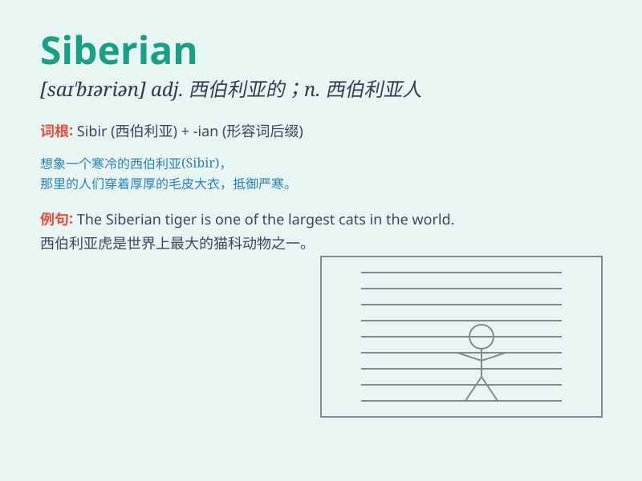

## Siberian

**英音:** _[saiˈbiəriən]_ **美音:** _[sɪˈbɪr.i.ən]_

**译义:** *西伯利亚的；属于或来自西伯利亚的*

### 短语

+ **Siberian tiger:** _西伯利亚虎_

+ **Siberian husky:** _西伯利亚哈士奇_

+ **Siberian crane:** _西伯利亚鹤_

+ **Siberian winter:** _西伯利亚的冬天_

+ **Siberian forest:** _西伯利亚森林_

### 例句

#### 例句1

> **The Siberian tiger is a magnificent and endangered species.**

**中文翻译:** 西伯利亚虎是一种壮观且濒危的物种。

**单词释义:** 西伯利亚的

#### 例句2

> **She has a Siberian husky as her pet.**

**中文翻译:** 她有一只西伯利亚哈士奇作为宠物。

**单词释义:** 西伯利亚的

#### 例句3

> **The Siberian winter is extremely cold.**

**中文翻译:** 西伯利亚的冬天极其寒冷。

**单词释义:** 西伯利亚的

### 背诵小故事

> A brave adventurer traveled to the cold land of Siberia. There, he
faced icy winds and saw beautiful snow scenes. Siberia is a place full
of mystery and challenge. Remember this, and you\'ll remember
\'Siberian\' means related to Siberia.

**一位勇敢的探险家前往寒冷的西伯利亚。在那里，他面对冰冷的风，看到了美丽的雪景。西伯利亚是一个充满神秘和挑战的地方。记住这个，你就会记住\'Siberian\'意思是与西伯利亚有关的。**

### 图义

