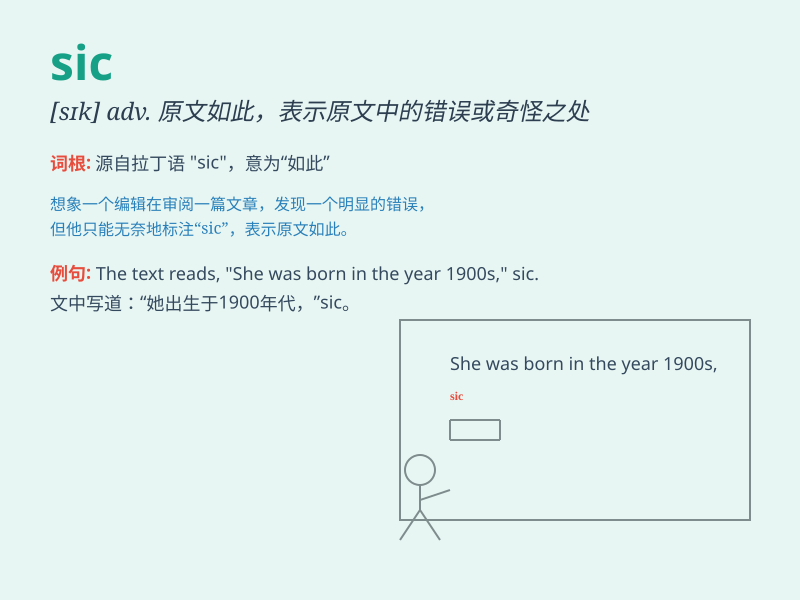

## sic

**英音:** _[sɪk]_ **美音:** _[sɪk]_

**译义:**
*adv.\<拉>原文如此(置括号中,表示前面所引的文字虽有错误或疑问,却是原文)*

### 短语

+ **sic passim:** _各处都这样；到处如此_

+ **sic erat scriptum:** _原文如此_

+ **sic transit gloria mundi:** _尘世的荣耀就此消逝_

+ **sic semper tyrannis:** _这就是暴君的下场_

+ **sic stantibus:** _（在）现状不变的情况下_

### 例句

#### 例句1

> **The note said, \'He is always late. sic\'**

**中文翻译:** 这张便条上写着：'他总是迟到。原文如此。'

**单词释义:**
（用于引述原文或原作者的文字，表示原文照录或照引）原文如此

#### 例句2

> **I copied the text sic as I found it.**

**中文翻译:** 我照原样抄录了这篇课文。

**单词释义:**
（用于引述原文或原作者的文字，表示原文照录或照引）原文如此

#### 例句3

> **The error was in the original document, sic.**

**中文翻译:** 这个错误在原始文件中，原文如此。

**单词释义:**
（用于引述原文或原作者的文字，表示原文照录或照引）原文如此

### 背诵小故事

> One day, a student wrote a wrong word in his composition. The teacher
marked it as \'sic\' to indicate that it was exactly as written by the
student without correction. This made the student understand the meaning
of \'sic\' as marking something unchanged despite its error.

**有一天，一个学生在作文中写错了一个单词。老师标注了'sic'，表示这就是学生所写的原样，不做修改。这让学生明白了'sic'表示标注某事物尽管有错但保持原样的意思。**

### 图义

