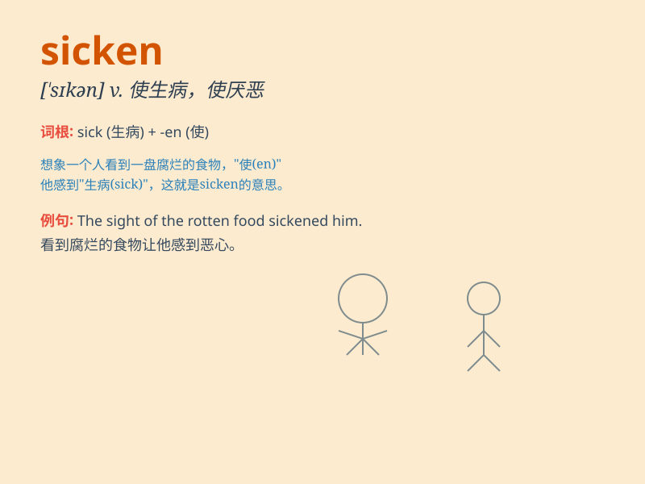

## sicken

**英音:** _[\'sɪk(ə)n]_ **美音:** _[\'sɪkən]_

**译义:** *vt.使患病,使嫌恶,使恶心或昏晕vi.得病,变厌腻*

### 短语

+ **sicken of:** _对\...感到厌倦_

+ **sicken for:** _渴望_

+ **be sickened by:** _因\...而感到恶心_

+ **sicken at:** _对\...感到憎恶_

+ **sicken with:** _患\...病_

### 例句

#### 例句1

> **The smell of the rotten food sickened me.**

**中文翻译:** 腐烂食物的气味让我感到恶心。

**单词释义:** 使恶心；使厌恶

#### 例句2

> **The news of the disaster sickened everyone.**

**中文翻译:** 灾难的消息让每个人都感到震惊和难过。

**单词释义:** 使震惊；使感到难过

#### 例句3

> **He sickened and died within a month.**

**中文翻译:** 他病倒了，并在一个月内去世了。

**单词释义:** 患病；生病

### 背诵小故事

> Once upon a time, a man ate some bad food and began to feel very
uncomfortable. His stomach was in a mess and he sicken. Finally, he had
to see a doctor.

**从前，有个人吃了些变质的食物，开始感觉非常不舒服。他的胃一团糟，生病了。最后，他不得不去看医生。**

### 图义

