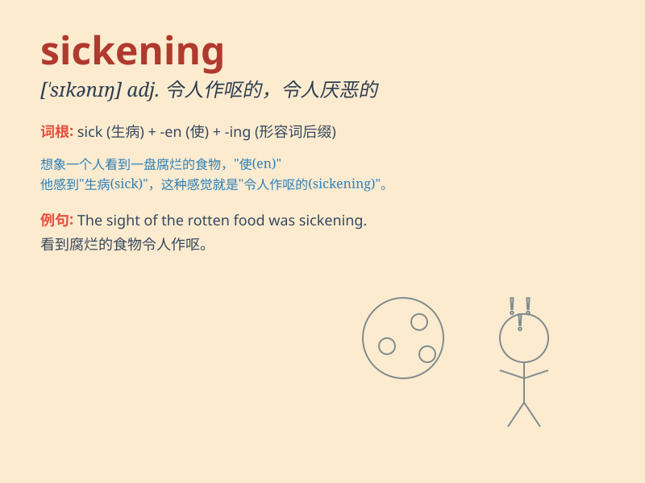

## sickening

**英音:** _[\'sɪkənɪŋ]_ **美音:** _[\'sɪkənɪŋ]_

**译义:** *adj.令人作呕的,使人昏晕的*

### 短语

+ **sickening smell:** _令人作呕的气味_

+ **sickening experience:** _令人厌恶的经历_

+ **sickening sight:** _令人恶心的景象_

+ **sickening thought:** _令人反感的想法_

+ **sickening behavior:** _令人讨厌的行为_

### 例句

#### 例句1

> **The smell of the rotten food was sickening.**

**中文翻译:** 腐烂食物的气味令人作呕。

**单词释义:** 令人厌恶的；令人恶心的

#### 例句2

> **The sight of the accident was sickening to behold.**

**中文翻译:** 事故的景象看着令人感到难受。

**单词释义:** 令人不适的；令人反感的

#### 例句3

> **The thought of his cruelty is sickening.**

**中文翻译:** 想到他的残忍就令人厌恶。

**单词释义:** 使人感到厌恶的

### 背诵小故事

> A girl was on a thrilling roller coaster ride. But suddenly, it went
too fast and the jerks were sickening. She felt extremely uncomfortable
and nauseous.

**一个女孩正在坐刺激的过山车。但突然，车开得太快，颠簸得令人作呕。她感到极度不适和恶心。**

### 图义

