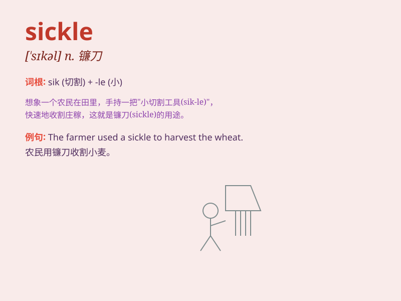

## sickle

**英音:** _[\'sɪk(ə)l]_ **美音:** _[\'sɪkl]_

**译义:** *n.镰刀*

### 短语

+ **sickle cell:** _镰状细胞_

+ **sickle cell anemia:** _镰状细胞性贫血_

+ **sickle knife:** _镰刀_

+ **sickle moon:** _弯月；月牙_

+ **sickle shape:** _镰刀形状_

### 例句

#### 例句1

> **The farmer used a sickle to cut the wheat.**

**中文翻译:** 这位农民用镰刀割小麦。

**单词释义:** 镰刀

#### 例句2

> **The sickle moon hung in the sky.**

**中文翻译:** 弯弯的月牙挂在天空。

**单词释义:** 镰刀形的（月亮）

#### 例句3

> **He held a sickle in his hand, ready to work in the field.**

**中文翻译:** 他手里拿着一把镰刀，准备去田里干活。

**单词释义:** 镰刀

### 背诵小故事

> A farmer was working hard in the field. Suddenly, his sickle broke.
He was very worried as the sickle was essential for harvesting. But
luckily, he fixed it and continued his work.

**一位农民正在田里辛苦劳作。突然，他的镰刀断了。他非常担心，因为镰刀对收割至关重要。但幸运的是，他修好了它，继续工作。**

### 图义

