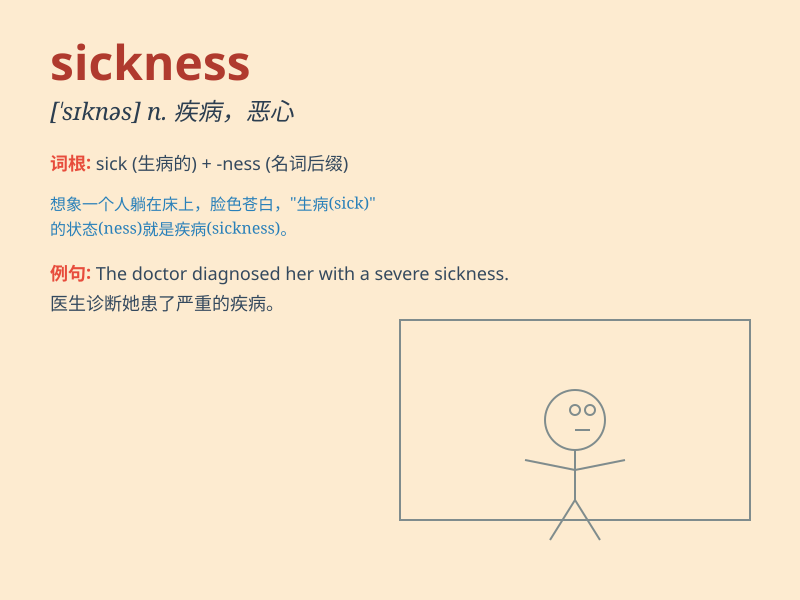

## sickness

**英音:** _[\'sɪknɪs]_ **美音:** _[\'sɪknəs]_

**译义:** *n.疾病,呕吐*

### 短语

+ **motion sickness:** _晕动病；晕车；晕船；晕机_

+ **mental sickness:** _精神疾病_

+ **occupational sickness:** _职业病_

+ **radiation sickness:** _辐射病_

+ **food poisoning sickness:** _食物中毒病_

### 例句

#### 例句1

> **She was absent from work due to sickness.**

**中文翻译:** 她因病缺勤。

**单词释义:** 疾病；不健康

#### 例句2

> **The doctor diagnosed his sickness as pneumonia.**

**中文翻译:** 医生诊断他的病为肺炎。

**单词释义:** 疾病

#### 例句3

> **Long-term stress can lead to various sicknesses.**

**中文翻译:** 长期的压力会导致各种疾病。

**单词释义:** 疾病

### 背诵小故事

> A brave astronaut was on a space mission. But suddenly, he felt
extreme discomfort and weakness. It turned out he was struck by
sickness. His team worked hard to bring him back safely and treat his
illness.

**一位勇敢的宇航员正在执行太空任务。但突然，他感到极度不适和虚弱。原来他生病了。他的团队努力将他安全带回并治疗他的疾病。**

### 图义

