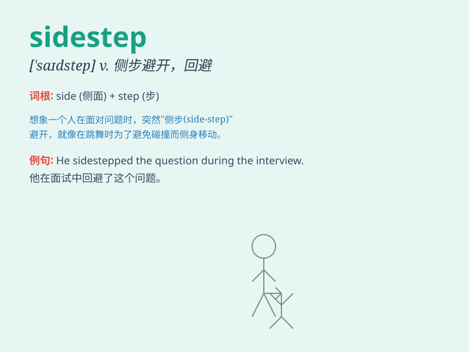

## sidestep

**英音:** _[\'saɪdstep]_ **美音:** _[\'saɪdstɛp]_

**译义:**
*n.横跨的一步,(侧面的)台阶vt.横跨一步躲闪,回避(困难)vi.回避问题,躲避打击*

### 短语

+ **sidestep an issue:** _回避某个问题_

+ **sidestep a trap:** _避开陷阱_

+ **sidestep a difficulty:** _规避困难_

+ **sidestep a challenge:** _躲开挑战_

+ **sidestep an obstacle:** _绕开障碍_

### 例句

#### 例句1

> **He managed to sidestep the issue by changing the subject.**

**中文翻译:** 他通过改变话题设法回避了这个问题。

**单词释义:** 回避；躲避

#### 例句2

> **The dancer sidestepped gracefully to avoid colliding with the
other performers.**

**中文翻译:** 舞者优雅地侧身移步以避免与其他表演者相撞。

**单词释义:** 侧身移步；横跨一步避开

#### 例句3

> **She tried to sidestep the difficult question during the
interview.**

**中文翻译:** 在采访中她试图避开那个难题。

**单词释义:** 避开；回避

### 背诵小故事

> A thief was running away. To avoid the police, he tried to sidestep
by quickly moving to the side and hiding behind a big tree. But the
police were smart and caught him.

**一个小偷正在逃跑。为了避开警察，他试图侧步躲开，快速移动到一边并躲在一棵大树后面。但警察很聪明，抓住了他。**

### 图义

