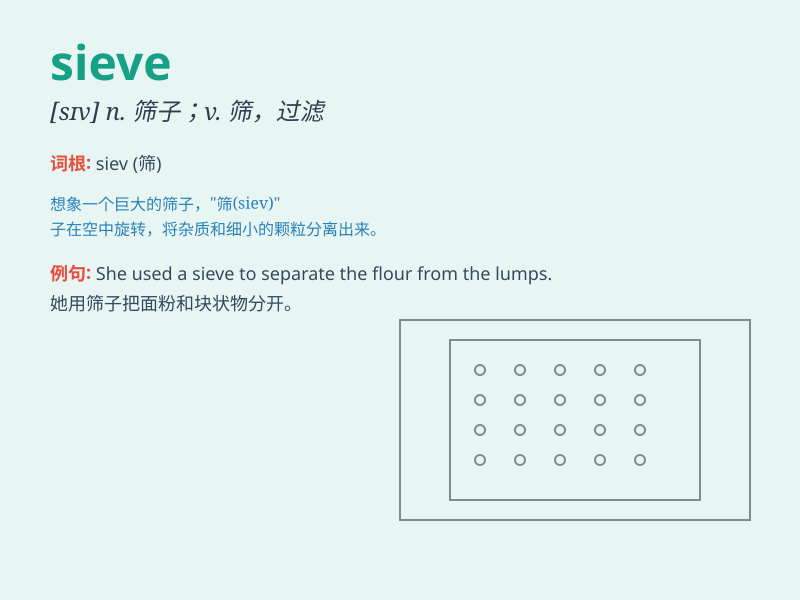

## sieve

**英音:** _[sɪv]_ **美音:** _[sɪv]_

**译义:** *n.筛,滤网,不会保密的人v.筛,过滤*

### 短语

+ **sieve out:** _筛选出；筛除_

+ **fine sieve:** _细筛_

+ **coarse sieve:** _粗筛_

+ **sieve mesh:** _筛网；筛孔_

+ **sieve plate:** _筛板_

### 例句

#### 例句1

> **She used a sieve to separate the flour from the lumps.**

**中文翻译:** 她用筛子把面粉中的块状物筛出来。

**单词释义:** 筛子

#### 例句2

> **The police are trying to sieve out useful information from the
suspect\'s confession.**

**中文翻译:** 警方正试图从嫌疑犯的供词中筛选出有用的信息。

**单词释义:** 筛选；过滤

#### 例句3

> **His memory is like a sieve; he always forgets things.**

**中文翻译:** 他的记性像个筛子，总是忘事。

**单词释义:** 像筛子一样（形容记忆力差）

### 背诵小故事

> A detective was looking for clues in a crime scene. He used a sieve
to filter the sand, hoping to find tiny pieces of evidence. Just like
the sieve separates fine particles, it helps us filter out what we need.

**一位侦探在犯罪现场寻找线索。他用筛子过滤沙子，希望能找到微小的证据。就像筛子分离细小颗粒一样，它帮助我们筛选出我们需要的东西。**

### 图义

