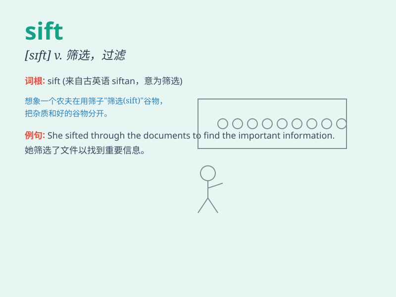

## sift

**英音:** _[sɪft]_ **美音:** _[sɪft]_

**译义:** *v.详审*

### 短语

+ **sift through:** _仔细检查；筛查_

+ **sift out:** _筛出；挑选出_

+ **sift the evidence:** _筛选证据_

+ **sift the flour:** _筛面粉_

+ **sift the data:** _筛选数据_

### 例句

#### 例句1

> **She sifted through the pile of papers to find the important
document.**

**中文翻译:** 她仔细翻查那堆文件以找到那份重要的文件。

**单词释义:** 仔细检查；筛选

#### 例句2

> **The baker sifted the flour to remove any lumps.**

**中文翻译:** 面包师筛面粉以去除任何团块。

**单词释义:** 筛；过滤

#### 例句3

> **The police are sifting the evidence to solve the crime.**

**中文翻译:** 警方正在仔细审查证据以侦破案件。

**单词释义:** 仔细审查；详审

### 背诵小故事

> A detective was sifting through a pile of evidence to find the
crucial clue. He carefully separated and examined each piece, just like
sifting flour to get the finest part.

**一位侦探正在仔细筛查一堆证据以找到关键线索。他认真地分拣和检查每一件，就像筛面粉以获取最精细的部分一样。**

### 图义

