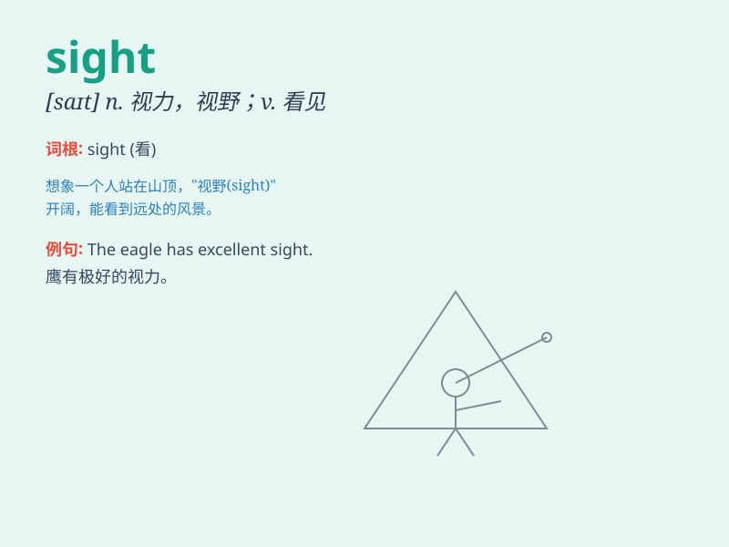

## sight

**英音:** _[saɪt]_ **美音:** _[saɪt]_

**译义:** *n.视力,视觉,见,瞥见,视域,眼界*

### 短语

+ **catch sight of:** _突然看到；发现_

+ **in sight:** _看得见；在眼前_

+ **lose sight of:** _看不见；忽略；忘记_

+ **at first sight:** _乍一看；初看之下_

+ **set one\'s sights on:** _以...为目标；决心做到_

### 例句

#### 例句1

> **The sight of the beautiful sunset took my breath away.**

**中文翻译:** 美丽的日落景象让我惊叹不已。

**单词释义:** 景象

#### 例句2

> **She lost her sight in a car accident.**

**中文翻译:** 她在一场车祸中失明了。

**单词释义:** 视力

#### 例句3

> **The tourists came to the city for the sights.**

**中文翻译:** 游客们为了观光来到这个城市。

**单词释义:** 名胜；风景

### 背诵小故事

> One day, while walking in the park, I suddenly caught sight of a
beautiful bird. Its colorful feathers and graceful flight made me stop
and admire. I was so lucky to have this wonderful sight.

**有一天，在公园散步时，我突然看到一只美丽的鸟。它多彩的羽毛和优雅的飞行让我驻足欣赏。我很幸运能有这样美好的景象。**

### 图义

