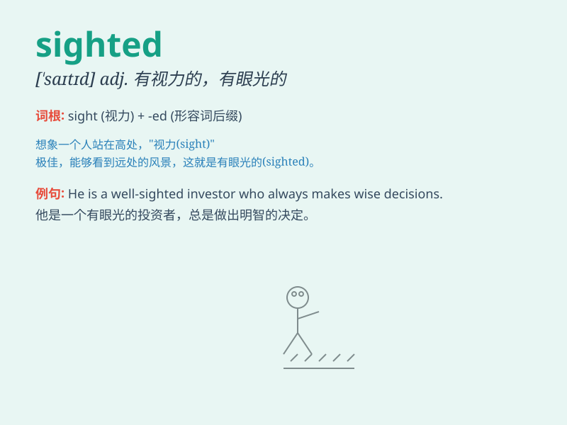

## sighted

**英音:** _[ˈsaɪtɪd]_ **美音:** _[ˈsaɪtɪd]_

**译义:** *adj.有视力的；有视力的；有眼光的；有见识的*

### 短语

+ **keen-sighted:** _目光敏锐的_

+ **far-sighted:** _有远见的；目光长远的_

+ **short-sighted:** _目光短浅的；近视的_

+ **sharp-sighted:** _目光锐利的；精明的_

+ **well-sighted:** _视力好的；观察仔细的_

### 例句

#### 例句1

> **The sighted guide helped the blind man cross the street.**

**中文翻译:** 这位有视力的向导帮助盲人过马路。

**单词释义:** 有视力的

#### 例句2

> **Sighted people often take their vision for granted.**

**中文翻译:** 有视力的人常常认为他们的视力是理所当然的。

**单词释义:** 有视力的

#### 例句3

> **The sighted passengers were able to enjoy the beautiful
scenery.**

**中文翻译:** 有视力的乘客能够欣赏美丽的风景。

**单词释义:** 有视力的

### 背诵小故事

> A blind man was always longing to be sighted. One day, a miracle
happened and he could finally see the beautiful world. From then on, he
cherished every sighted moment.

**一个盲人一直渴望能看得见。有一天，奇迹发生了，他终于能看到美丽的世界。从此，他珍惜每一个能看见的时刻。**

### 图义

