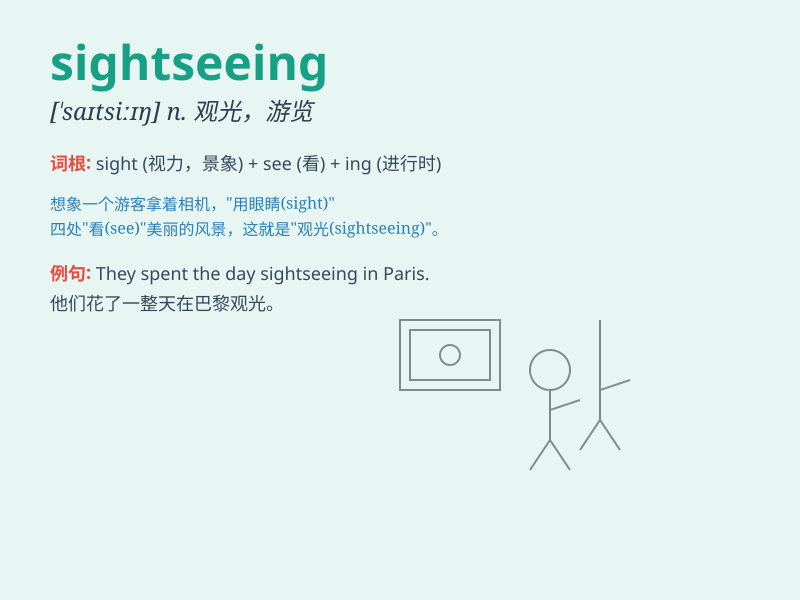

## sightseeing

**英音:** _[\'saɪtsiːɪŋ]_ **美音:** _[\'saɪtsiɪŋ]_

**译义:** *n.观光*

### 短语

+ **go sightseeing:** _去观光_

+ **sightseeing tour:** _观光旅游_

+ **sightseeing spot:** _观光景点_

+ **sightseeing bus:** _观光巴士_

+ **enjoy sightseeing:** _享受观光_

### 例句

#### 例句1

> **We went sightseeing in Paris last summer.**

**中文翻译:** 去年夏天我们在巴黎观光。

**单词释义:** 观光；游览

#### 例句2

> **The city offers great opportunities for sightseeing.**

**中文翻译:** 这座城市提供了很好的观光机会。

**单词释义:** 观光；游览

#### 例句3

> **I spent the day sightseeing around the old town.**

**中文翻译:** 我花了一天时间在老城区观光。

**单词释义:** 观光；游览

### 背诵小故事

> One day, Tom went to a new city for sightseeing. He saw beautiful
buildings and interesting people. He enjoyed the views and took many
photos. Sightseeing made his day wonderful.

**有一天，汤姆去一个新城市观光。他看到了漂亮的建筑和有趣的人。他欣赏风景并拍了很多照片。观光让他这一天很美好。**

### 图义

